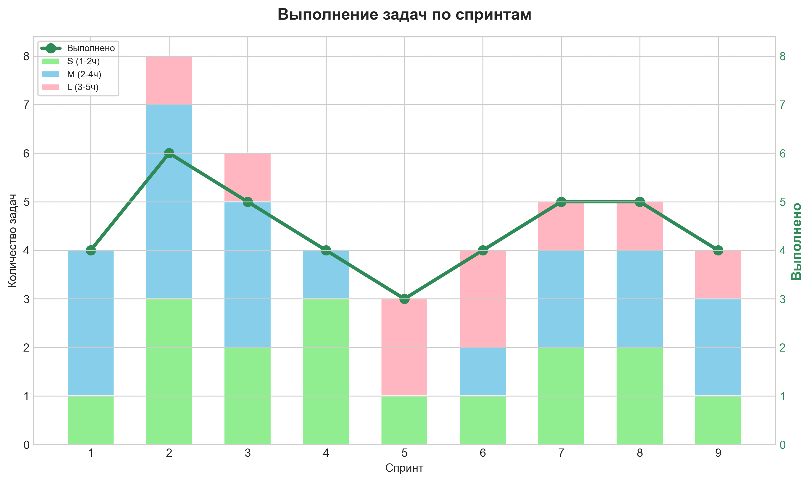
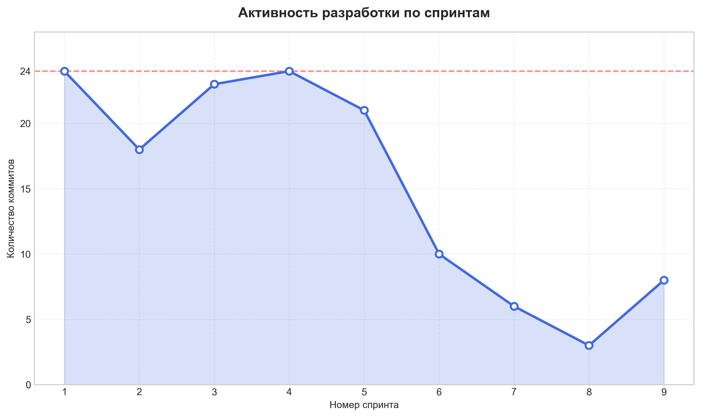
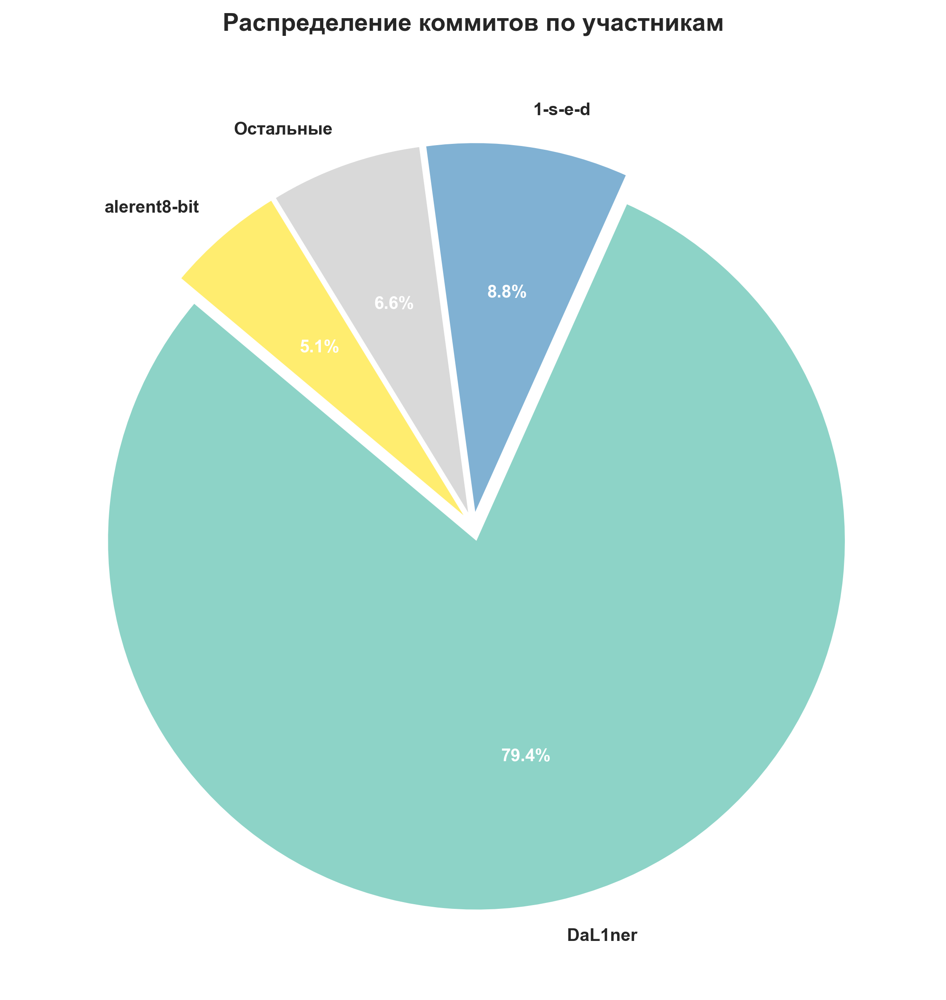
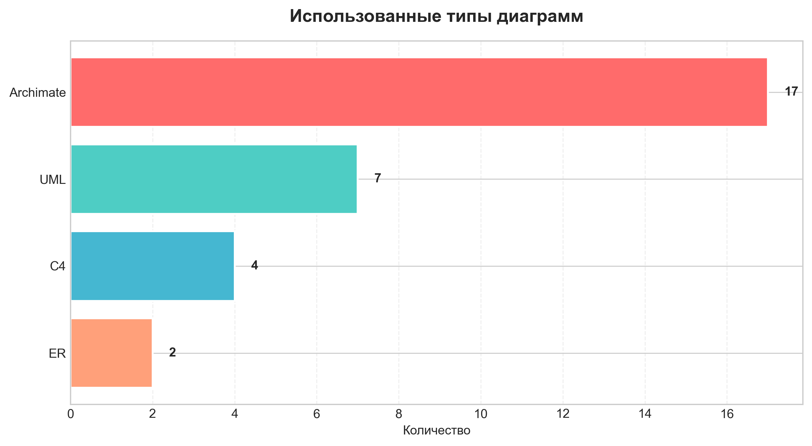
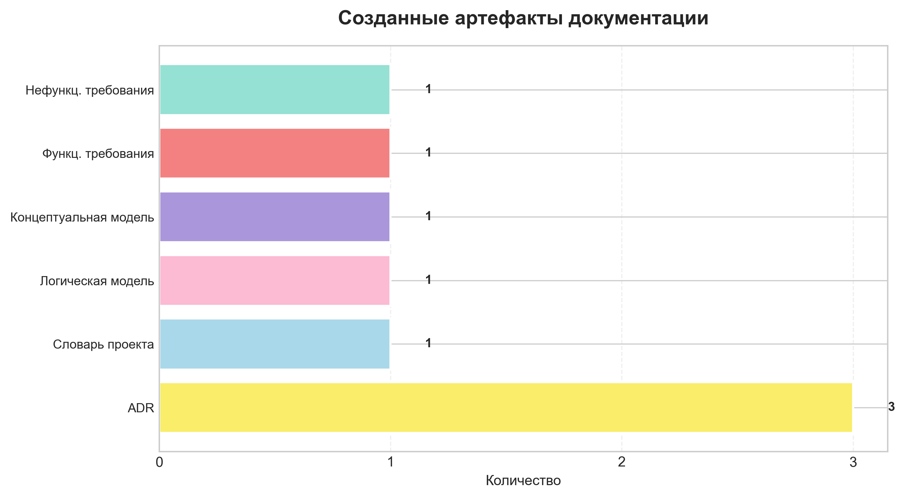

# Отчёт по итогам 9 спринтов

> **Период отчёта:** Спринты 1–9 (Учебные недели 3–11)  
> **Фокус этапа:** Бизнес-анализ, архитектурное моделирование, формирование требований, подготовка технологического стека и слоя данных.

---

## 🔑 Ключевые показатели этапа

| Метрика | Значение |
|:---|:---|
| Всего запланировано задач | 43 |
| Выполнено задач в срок | 40 (`~93%`) |
| Перенесено на следующий спринт | 3 |
| Общее число коммитов | 136 |
| Архитектурных диаграмм | 30 |
| Подготовленных документов | 8 |
| Встреч с преподавателем | 3 |

---

## 🗓️ Динамика выполнения задач по спринтам

| Спринт | Неделя | Название | Запланировано (L+M+S) | Выполнено | Не успели | % выполнения |
|:---:|:---:|:---|:---:|:---:|:---:|:---:|
| 1 | 3 | Организация и начало работы | 4 | 4 | 0 | 100% |
| 2 | 4 | Выделение бизнес-процессов и подбор технологий | 8 | 6 | 2 | 75% |
| 3 | 5 | Уточнение бизнес-процессов и формирование требований | 6 | 5 | 1 | 83% |
| 4 | 6 | Завершение формирования требований | 4 | 4 | 0 | 100% |
| 5 | 7 | Формирование модели данных | 3 | 3 | 0 | 100% |
| 6 | 8 | Применение модели данных | 4 | 4 | 0 | 100% |
| 7 | 9 | Завершение слоя Application | 5 | 5 | 0 | 100% |
| 8 | 10 | Начало формирования слоя Technology | 5 | 5 | 0 | 100% |
| 9 | 11 | Завершение формирования слоя Technology | 4 | 4 | 0 | 100% |
| **Итого** | – | – | **43** | **40** | **3** | **93%** |

📈 **Анализ:**  
После адаптационных спринтов 2–3 команда вышла на стабильный темп выполнения (`100%` с 4-го спринта).

---

## 👥 Активность команды и распределение коммитов

### По участникам
| Участник | Коммиты | Доля |
|:---|:---:|:---:|
| `DaL1ner` | 108 | 79.4% |
| `1-s-e-d` | 12 | 8.8% |
| `alerent8-bit` | 7 | 5.1% |
| `derizhable` | 4 | 2.9% |
| `adalar4ik` | 4 | 2.9% |
| `anastasia1233455` | 1 | 0.7% |
| **Всего** | **136** | **100%** |

### По спринтам
| Спринт | Коммиты |
|:---:|:---:|
| 1 | 24 |
| 2 | 18 |
| 3 | 23 |
| 4 | 24 |
| 5 | 21 |
| 6 | 10 |
| 7 | 6 |
| 8 | 3 |
| 9 | 8 |
| **Всего** | **136** |

📉 **Анализ:**  
Высокая концентрация коммитов в первых спринтах соответствует этапу настройки репозитория, создания структуры проекта и активного архитектурного проектирования. Спад в спринтах 6–8 объясняется смещением фокуса на моделирование, документацию и согласование решений.  

---

## 📐 Архитектурное моделирование и документация

### Диаграммы
| Тип | Количество |
|:---|:---:|
| Archimate | 17 |
| UML | 7 |
| C4 | 4 |
| ER | 2 |
| **Всего** | **30** |

### Документы
| Документ | Кол-во |
|:---|:---:|
| Функциональные требования | 1 |
| Нефункциональные требования | 1 |
| Концептуальная модель данных | 1 |
| Логическая модель данных | 1 |
| Словарь проекта | 1 |
| ADR (Architecture Decision Records) | 3 |
| **Всего** | **8** |

📝 **Анализ:**  
Команда продемонстрировала зрелый подход к проектированию: от высокоуровневой бизнес-архитектуры (Archimate, C4) до детализации на уровне кода и БД (UML, ER). Наличие 3 ADR подтверждает осознанное принятие технологических решений. Документация полностью покрывает этап и готова к передаче в разработку.

---

## 🛠️ Инфраструктура и дополнительные результаты

- Организован Git-репозиторий и Kanban-доска  
- Определены роли проекта  
- Согласован и зафиксирован технологический стек  
- Выполнено задание на нормализацию таблиц БД  
- Подготовлены 2 интерактивных макета интерфейса (UI/UX)  
- Развёрнута тестовая БД в Docker-контейнере  
- Сформирован и ведётся словарь проекта  

---

Отчёт сформирован: [28.04.2026]  

