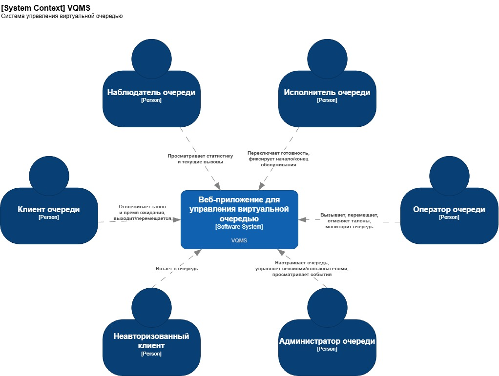
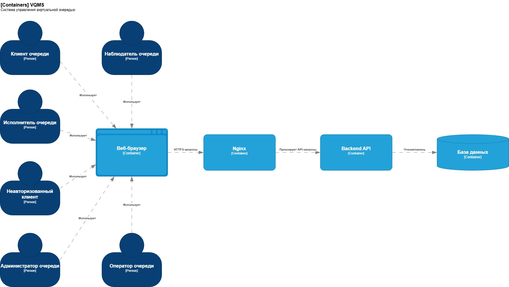
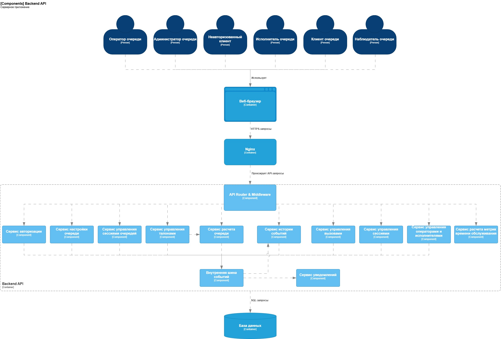
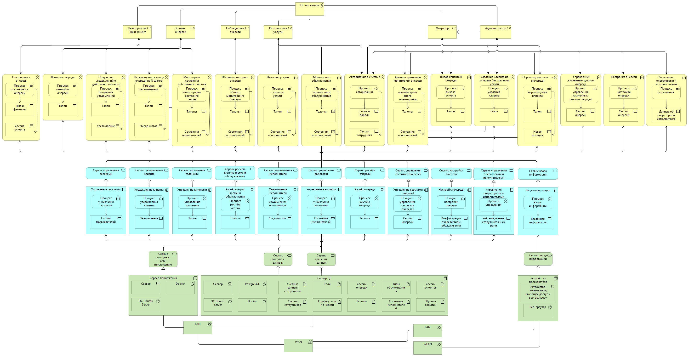

# Архитектура системы

## Описание системы

Идея разработки системы возникла в ответ на актуальную проблему неэффективного распределения времени при ожидании в физических очередях, в частности — при сдаче практических и курсовых работ в учебных заведениях.  
  
Студенты вынуждены тратить значительное время на ожидание в физических очередях, вручную контролируя изменения потока, что нередко ведёт к организационным конфликтам и непродуктивному использованию времени. Преподаватели, в свою очередь, не имеют инструментов для прогнозирования и управления этим потоком, что существенно усложняет процедуру проверки при большом объёме работ.  
  
Анализ показал, что аналогичные проблемы характерны и для других местах, где отсутствует должный уровень автоматизации процесса управления очередью.  
  
В связи с этим была поставлена цель разработать систему для управления виртуальной очередью, обеспечивающую удобную запись, мониторинг статуса и оптимизацию фактического потока клиентов.  
  
## Роли пользователей системы

На основе анализа предметной области и постановки задачи выделены главные пользователи системы, чьи интересы необходимо учитываются при разработке требований к системе:

- **Клиент очереди** - основной потребитель услуги. Обладает возможностью отслеживать статус талона, покидать очередь и уступать место другим участникам;
- **Исполнитель услуги** - сотрудник точки обслуживания, осуществляющий вызов клиента, оказание услуги и управление статусом текущего обслуживания.
  
Кроме того, можно выделить и другие типы пользователей, которые так же будут осуществлять работу с системой:

- **Оператор** - сотрудник, осуществляющий ручное управление потоком очереди: вызов, перемещение или удаление клиентов без оказания услуги, а также углублённый мониторинг состояния очереди;
- **Администратор** - сотрудник, управляющий жизненным циклом очереди, конфигурацией параметров очереди и типов обслуживания, назначением ролей сотрудникам и аудитом истории событий;
- **Неавторизованный клиент** - пользователь, не начавший активную клиентскую сессию, но имеющий возможность инициировать постановку в очередь;
- **Наблюдатель очереди** - участник системы с правами только на просмотр общего состояния очереди без возможности получения талона или управления потоком
  
**Важно:** В MVP системы реализуются две базовые роли: Клиент и комбинированная роль Исполнитель+Оператор  

*Более подробно рассмотреть роли пользователей системы можно в [документации ролей](requirements/roles.md)*

## Требования к системе

На основе анализа потребностей заинтересованных сторон принято архитектурное решение реализовать систему в виде веб-приложения, доступ к которому осуществляется через веб-браузер на клиентском устройстве. Такое решение позволяет обеспечить пользователям удобный и гибкий формат доступа без необходимости установки специализированного программного обеспечения.  
  
**Функциональные требования** определяют возможности взаимодействия пользователей с системой:

- Клиенту предоставляется возможность регистрации в очереди, отслеживания текущего статуса и положения, получения уведомлений и выхода из очереди через веб-интерфейс. Важно отметить, что добавление в очередь осуществляется без авторизации. Хранение профилей клиентов в рамках данного проекта не предусматривается;  
- Операторам и исполнителям система предоставляет инструменты для управления потоком, такие как ручной и автоматический вызов клиентов, изменение их позиции и исключение из очереди, а также просмотр статистических показателей в реальном времени. Доступ сотрудников к функционалу управления осуществляется по учётным данным, создаваемым администратором системы.  
  
*Детальное описание функциональных требований представлено [здесь](requirements/functional.md)*  
  
**Нефункциональные требования** охватывают аспекты безопасности, производительности и надёжности:

- Должны соблюдаться требования к безопасности, такие как хешированное хранение паролей, передача данных по защищённому протоколу HTTPS и защита от типовых веб-уязвимостей;  
- Время отклика системы на пользовательские запросы не должно превышать 3 секунд;
- Сохранность настроек, истории работы системы и данных очереди при эксплуатации должна быть гарантирована.  
  
*Детальное описание нефункциональных требований представлено [здесь](requirements/non-functional.md)*  

## Общая архитектурная модель

На основании проведённого анализа, в качестве архитектурного типа для серверной части системы выбрана модульная архитектура с использованием тонкого клиента. Такой подход должен способствовать ускорению разработки на начальных этапах и улучшению поддержки кода.  
Отказ от микросервисной архитектуры в пользу модульного монолита обусловлен излишними на данный момент расходами на организацию и оркестрацию отдельных микросервисов. Однако в дальнейшем этот переход остаётся осуществимым ввиду слабой связанности компонентов и чётким границам их ответственности.  
  
Клиентская часть реализована в виде веб-приложения, функционирующего в браузере пользователя и взаимодействующего с сервером посредством REST API и polling запросов.  
  
*Обоснование архитектурного выбора представлено в [ADR-002](adr/002-architectural-style.md)*  
  

### Декомпозиция серверной части

Модульная архитектура подразумевает, что серверная часть системы будет разделена на логические компоненты, каждый из которых объединяет бизнес-логику, связанную с определённой предметной областью. Модули взаимодействуют с единой базой данных.  
  
Несмотря на то, что модульная архитектура не требует строгого соблюдения принципа слабой связанности, в данной реализации он выдержан для всех компонентов. Это обеспечивает возможность независимого тестирования, модификации и замены модулей без влияния на остальные компоненты системы.  
  
Обработка клиентских запросов обеспечивается встроенным API-маршрутизатором серверного приложения, который выполняет роль оркестратора компонетов, делегируя исполнение отдельных частей запроса пользователя определённым модулям и возвращая сформированный ответ. Контроль доступа на основе ролевой модели реализуется посредством middleware, интегрированных в конвейер обработки запросов.  
  
Для обеспечения асинхронного взаимодействия модули после завершения значимых бизнес-операций генерируют события, которые публикуются во внутреннюю шину событий. Эти события в дальнейшем используются для отправки уведомлений и логирования действий пользователей для последующей аналитики.  
  
*Описание компонентов системы представлено в [словаре терминов](dictionary.md)*  
  
**Важно:** Несмотря на использование термина «Сервис» в наименовании модулей, они не представляют собой микросервисы.  

### Логическая организация данных

Декомпозиция модулей произведена на основе анализа предметных областей системы. Каждый модуль отвечает за свой ограниченный контекст и работает только с определённым набором сущностей. Такой подход помогает улучшить целостность данных, разделяя ответственность за данные между компонентами.  
Например, модуль «Сервис управления талонами», несёт ответственность за работу с сущностью «ticket» и имеет все необходимые методы для осуществления этого.  
  
**Логическая модель данных** системы построена на основе реляционной парадигмы и нормализована до третьей нормальной формы с целью исключения аномалий вставки, обновления и удаления.  
  
Модель включает следующие ключевые сущности:

- Ticket (талон) — центральная сущность системы. Является представлением клиента в очереди;
- User (пользователь) — учётные данные сотрудников с привязкой к ролям;
- Queue (очередь) — сущность, описывающая параметры и конфигурацию очереди;
- ExecutorState — сущность, реализующая связь между исполнителем и клиентом. Хранит состояние готовности исполнителя.
  
Кроме этого, моделью данных предусмотрены сущности для хранения сессий пользователей, справочников, и событий.  
  
*Детальная спецификация атрибутов и связей представлена в [описании логической модели данных](data-model/logical-data-model.md)*  

  
### Архитектурное представление в нотации ArchiMate 3.0

Для комплексного описания архитектуры системы на всех уровнях абстракции построена общая диаграмма системы в нотации ArchiMate 3.0, которая демонстрирует взаимосвязи между бизнес-уровнем, уровнем приложений и технологическим уровнем.  
  

