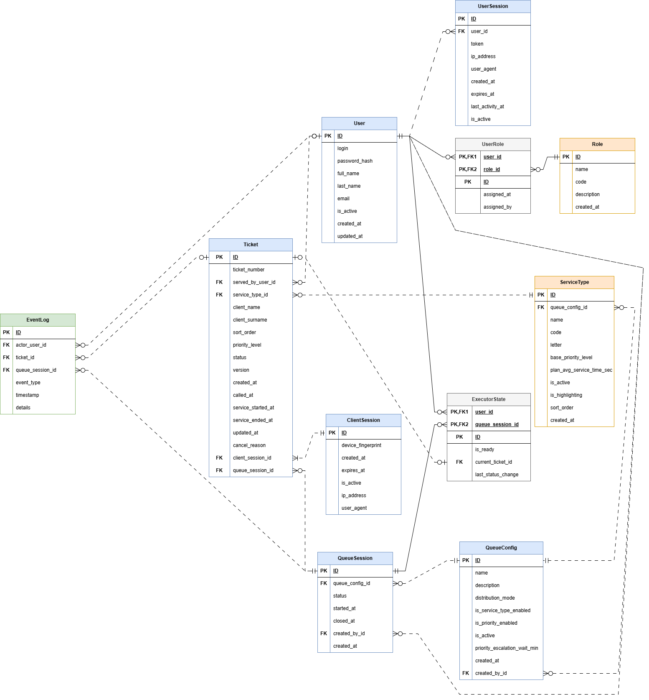
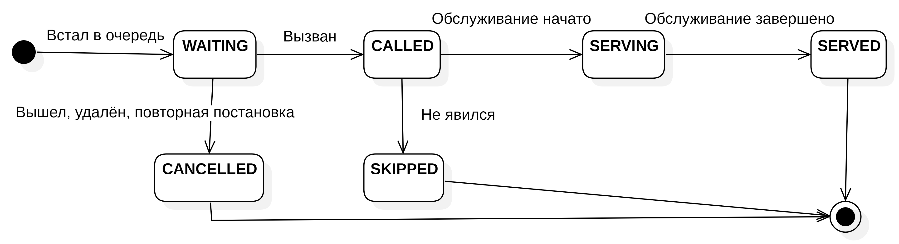

# Логическая модель данных
## Virtual Queue Management System

*Версия: 1.3 | Обновлено: 27.04.2026*

---

## 1. Обзор модели

Данная логическая модель данных разработана для системы управления виртуальной очередью. Модель является детализацией концептуальной модели

**Ключевые архитектурные решения:**

- Разделение конфигурации очереди (`QueueConfig`) и сессии (`QueueSession`) для хранения истории
- Приоритет определяется типом услуги (`ServiceType`), а не выбирается клиентом
- Позиция в очереди через `sort_order` (DECIMAL) для O(1) перемещения
- Оптимистичная блокировка через `version` для конкурентного доступа
- Аудит всех событий через `EventLog`

---

## 2. Сущности

### 2.1. User (Пользователь системы)

**Назначение:** Хранение учётных данных сотрудников (Администраторы, Операторы, Исполнители).

| Атрибут | Тип данных | Ограничения | Описание |
|---------|------------|-------------|----------|
| `id` | `INTEGER` | `PK`, `AUTO_INCREMENT` | Уникальный идентификатор пользователя |
| `login` | `VARCHAR(100)` | `NOT NULL`, `UNIQUE` | Логин для входа в систему |
| `password_hash` | `VARCHAR(255)` | `NOT NULL` | Хешированный пароль (bcrypt/argon2) |
| `full_name` | `VARCHAR(255)` | `NOT NULL` | Полное имя сотрудника |
| `last_name` | `VARCHAR(255)` | `NOT NULL` | Полная фамилия сотрудника |
| `email` | `VARCHAR(255)` | `NULL`, `UNIQUE` | Контактный email |
| `is_active` | `BOOLEAN` | `NOT NULL`, `DEFAULT true` | Флаг активности учётной записи |
| `created_at` | `TIMESTAMP` | `NOT NULL`, `DEFAULT NOW()` | Дата создания записи |
| `updated_at` | `TIMESTAMP` | `NULL`, `DEFAULT NOW()` | Дата последнего обновления |

**Ключи:**

- Первичный ключ: `id`
- Уникальные: `login`, `email`

**Индексы:**

- `idx_user_login` (`login`) — для быстрого поиска при авторизации

**Триггеры:**

- `trg_users_set_updated_at` — автоматически обновляет `updated_at` при изменении записи

---

### 2.2. UserSession (Сессия системной роли)

**Назначение:** Хранение активных сессий авторизованных сотрудников системы.

| Атрибут | Тип данных | Ограничения | Описание |
|---------|------------|-------------|----------|
| `id` | `INTEGER` | `PK`, `AUTO_INCREMENT` | Уникальный идентификатор |
| `user_id` | `INTEGER` | `NOT NULL`, `FK → User(id) ON DELETE CASCADE` | Пользователь |
| `token` | `VARCHAR(255)` | `NOT NULL`, `UNIQUE` | Токен сессии |
| `ip_address` | `VARCHAR(45)` | `NULL` | IP-адрес входа |
| `user_agent` | `TEXT` | `NULL` | Браузер/устройство |
| `created_at` | `TIMESTAMP` | `NOT NULL`, `DEFAULT NOW()` | Время создания |
| `expires_at` | `TIMESTAMP` | `NOT NULL` | Время истечения |
| `last_activity_at` | `TIMESTAMP` | `NOT NULL`, `DEFAULT NOW()` | Последняя активность |
| `is_active` | `BOOLEAN` | `NOT NULL`, `DEFAULT true` | Флаг активности |

**Ключи:**

- Первичный ключ: `id`
- Уникальные: `token`
- Внешние ключи: `user_id → User(id)`

**Индексы:**

```sql
idx_usersession_token (token)  
idx_usersession_user (user_id, is_active)  
idx_usersession_expires (expires_at)  
```

**Бизнес-правила:**

- Сессия создаётся при успешной авторизации
- Сессия продлевается при активности пользователя
- Сессия инвалидируется при выходе из системы
- Сессия инвалидируется при входе в один аккаунт с другого устройства
- Все сессии пользователя инвалидируются при смене пароля

---

### 2.3. Role (Роль)

**Назначение:** Справочник системных ролей. Определяет права доступа к функциям системы.

| Атрибут | Тип данных | Ограничения | Описание |
|---------|------------|-------------|----------|
| `id` | `INTEGER` | `PK`, `AUTO_INCREMENT` | Уникальный идентификатор роли |
| `name` | `VARCHAR(100)` | `NOT NULL`, `UNIQUE` | Отображаемое название роли |
| `code` | `VARCHAR(50)` | `NOT NULL`, `UNIQUE` | Системный код для проверки прав |
| `description` | `TEXT` | `NULL` | Описание полномочий роли |
| `created_at` | `TIMESTAMP` | `NOT NULL`, `DEFAULT NOW()` | Дата создания роли |

**Ключи:**

- Первичный ключ: `id`
- Уникальные: `name`, `code`

**Предустановленные роли:**

- `ADMIN` — Администратор системы
- `OPERATOR` — Оператор очереди
- `EXECUTOR` — Исполнитель услуги

---

### 2.4. UserRole (Связь Сотрудник-Роль)

**Назначение:** Реализация связи «Многие-ко-Многим» между сотрудниками и ролями.

| Атрибут | Тип данных | Ограничения | Описание |
|---------|------------|-------------|----------|
| `id` | `INTEGER` | `PK`, `AUTO_INCREMENT` | Уникальный идентификатор записи |
| `user_id` | `INTEGER` | `NOT NULL`, `FK -> User(id) ON DELETE CASCADE` | Ссылка на пользователя |
| `role_id` | `INTEGER` | `NOT NULL`, `FK -> Role(id) ON DELETE CASCADE` | Ссылка на роль |
| `assigned_at` | `TIMESTAMP` | `NOT NULL`, `DEFAULT NOW()` | Дата назначения роли |
| `assigned_by` | `INTEGER` | `NULL`, `FK -> User(id) ON DELETE SET NULL` | Кто назначил роль |

**Ключи:**

- Первичный ключ: `id`
- Уникальный составной: `UNIQUE(user_id, role_id)` — запрет дублирования

**Индексы:**

- `idx_userrole_user` (`user_id`) — поиск ролей пользователя
- `idx_userrole_role` (`role_id`) — поиск пользователей по роли

---

### 2.5. QueueConfig (Конфигурация очереди)

**Назначение:** Шаблон очереди с настройками, не меняющимися в рамках сессии.

| Атрибут | Тип данных | Ограничения | Описание |
|---------|------------|-------------|----------|
| `id` | `INTEGER` | `PK`, `AUTO_INCREMENT` | Уникальный идентификатор очереди |
| `name` | `VARCHAR(255)` | `NOT NULL` | Отображаемое название очереди |
| `description` | `TEXT` | `NULL` | Подробное описание очереди |
| `distribution_mode` | `distribution_mode (ENUM)` | `NOT NULL`, `DEFAULT 'MANUAL'` | Режим вызова клиентов: ручной или автоматический |
| `is_service_type_enabled` | `BOOLEAN` | `NOT NULL`, `DEFAULT false` | Требовать ли выбор услуги |
| `is_priority_enabled` | `BOOLEAN` | `NOT NULL`, `DEFAULT true` | Разрешено ли приоритетное обслуживание |
| `priority_escalation_wait_min` | `INTEGER` | `DEFAULT NULL`, `CHECK (NULL OR >= 0)` | Время ожидания (мин), после которого приоритет повышается |
| `is_active` | `BOOLEAN` | `NOT NULL`, `DEFAULT true` | Флаг активности конфигурации |
| `created_at` | `TIMESTAMP` | `NOT NULL`, `DEFAULT NOW()` | Дата создания конфигурации |
| `created_by_id` | `INTEGER` | `NOT NULL`, `FK -> User(id) ON DELETE RESTRICT` | Администратор-создатель |

**Ключи:**

- Первичный ключ: `id`
- Внешние ключи: `created_by -> User(id)`

**Типы distribution_mode:**

- `MANUAL` - Оператор вызывает клиентов вручную
- `AUTO` - Система автоматически назначает готовым исполнителям

**Бизнес-правила:**

- При `priority_escalation_wait_min` = NULL автоматическое повышение приоритета ожидающих длительное время клиентов отключено

**Проверочные ограничения:**

```
CHECK (distribution_mode IN ('MANUAL', 'AUTO'))
CHECK (priority_escalation_wait_min IS NULL OR priority_escalation_wait_min >= 0)
```

---

### 2.6. QueueSession (Сессия очереди)

**Назначение:** Конкретный запуск очереди во времени. Позволяет хранить историю работы.

| Атрибут | Тип данных | Ограничения | Описание |
|---------|------------|-------------|----------|
| `id` | `INTEGER` | `PK`, `AUTO_INCREMENT` | Уникальный идентификатор сессии |
| `queue_config_id` | `INTEGER` | `NOT NULL`, `FK -> QueueConfig(id) ON DELETE CASCADE` | Ссылка на конфигурацию |
| `status` | `session_status (ENUM)` | `NOT NULL`, `DEFAULT 'DRAFT'` | DRAFT, OPEN, PAUSED, CLOSED |
| `started_at` | `TIMESTAMP` | `NULL` | Фактическое время начала работы |
| `closed_at` | `TIMESTAMP` | `NULL` | Время завершения сессии |
| `created_by` | `INTEGER` | `NOT NULL`, `FK -> User(id) ON DELETE RESTRICT` | Администратор, запустивший сессию |
| `created_at` | `TIMESTAMP` | `NOT NULL`, `DEFAULT NOW()` | Дата создания сессии |

**Ключи:**

- Первичный ключ: `id`
- Внешние ключи: `queue_config_id -> QueueConfig(id)`, `created_by -> User(id)`

**Типы status:**

- `DRAFT` - Черновик, не активна
- `OPEN` - Активна, принимает клиентов
- `PAUSED` - На паузе, не принимает новых
- `CLOSED` - Завершена

**Вычисляемые значения:**

- `avg_service_time_actual` - рассчитывается как среднее `AVG(service_ended_at - service_started_at)` по всем талонам со статусом `SERVED` в рамках сессии

**Индексы:**

- `idx_session_queue_status` (`queue_config_id`, `status`) — поиск активных сессий
- `uq_queue_sessions_one_open_per_config` (`queue_config_id`) WHERE `status = 'OPEN'` — только одна активная сессия на очередь

**Проверочные ограничения:**

```
CHECK (status IN ('DRAFT', 'OPEN', 'PAUSED', 'CLOSED'))
CHECK (closed_at IS NULL OR closed_at >= started_at)
```

**Бизнес-правила:**

- Только одна сессия со статусом `OPEN` может быть активна для одной `queue_config_id`

---

### 2.7. Ticket (Талон / Запись в очередь)

**Назначение:** Ключевая сущность системы. Представляет клиента в очереди.

| Атрибут | Тип данных | Ограничения | Описание |
|---------|------------|-------------|----------|
| `id` | `INTEGER` | `PK`, `AUTO_INCREMENT` | Уникальный идентификатор талона |
| `queue_session_id` | `INTEGER` | `NOT NULL`, `FK -> QueueSession(id) ON DELETE CASCADE` | Ссылка на сессию |
| `service_type_id` | `INTEGER` | `NULL`, `FK -> ServiceType(id) ON DELETE SET NULL` | Ссылка на тип услуги |
| `ticket_number` | `VARCHAR(20)` | `NOT NULL` | Видимый номер (напр. «А-005»). Формируется атомарно при вставке |
| `client_name` | `VARCHAR(100)` | `NOT NULL` | Имя клиента |
| `client_surname` | `VARCHAR(100)` | `NOT NULL` | Фамилия клиента |
| `sort_order` | `DECIMAL(20,10)` | `NOT NULL`, `CHECK (>= 0)` | Позиция для сортировки в очереди |
| `priority_level` | `INTEGER` | `NOT NULL`, `DEFAULT 0`, `CHECK (>= 0)` | Текущий приоритет данного клиента. Изначально соответствует приоритету типа обслуживания |
| `status` | `ticket_status (ENUM)` | `NOT NULL`, `DEFAULT 'WAITING'` | Текущий статус талона |
| `version` | `INTEGER` | `NOT NULL`, `DEFAULT 1`, `CHECK (>= 1)` | Для оптимистичной блокировки |
| `created_at` | `TIMESTAMP` | `NOT NULL`, `DEFAULT NOW()` | Время записи |
| `called_at` | `TIMESTAMP` | `NULL` | Время вызова |
| `service_started_at` | `TIMESTAMP` | `NULL` | Начало обслуживания |
| `service_ended_at` | `TIMESTAMP` | `NULL` | Завершение обслуживания |
| `updated_at` | `TIMESTAMP` | `NULL`, `DEFAULT NOW()` | Дата последнего изменения |
| `served_by_user_id` | `INTEGER` | `NULL`, `FK -> User(id) ON DELETE SET NULL` | Исполнитель |
| `client_session_id` | `INTEGER` | `NULL`, `FK -> ClientSession(id) ON DELETE SET NULL` | Сессия устройства |
| `cancel_reason` | `TEXT` | `NULL` | Причина отмены/пропуска |

**Ключи:**

- Первичный ключ: `id`
- Внешние ключи: `queue_session_id`, `service_type_id`, `served_by_user_id`, `client_session_id`
- Уникальный составной: `UNIQUE(queue_session_id, ticket_number)` — запрет дублирования номеров в сессии

**Типы status:**

- `WAITING` - Ожидает вызова
- `CANCELLED` - Отменён клиентом или оператором
- `CALLED` - Вызван, ожидает подтверждения
- `SERVING` - Обслуживается
- `SERVED` - Обслужен успешно
- `SKIPPED` - Пропущен (не явился)

**Индексы:**

```
idx_ticket_queue_sort     (queue_session_id, status, priority_level DESC, sort_order ASC, created_at ASC)
idx_ticket_client_session (client_session_id, status)
idx_ticket_status_time    (queue_session_id, status, created_at)
idx_ticket_service_type   (queue_session_id, service_type_id, status)
uq_tickets_one_active_per_client_session (client_session_id) WHERE status IN ('WAITING', 'CALLED')
```

**Проверочные ограничения:**

```
CHECK (status IN ('WAITING', 'CALLED', 'SERVING', 'SERVED', 'SKIPPED', 'CANCELLED'))
CHECK (called_at IS NULL OR called_at >= created_at)
CHECK (service_started_at IS NULL OR service_started_at >= created_at)
CHECK (service_ended_at IS NULL OR service_started_at IS NULL OR service_ended_at >= service_started_at)
CHECK ((status = 'SERVED' AND service_ended_at IS NOT NULL) OR status != 'SERVED')
CHECK ((status IN ('SERVED', 'SKIPPED', 'CANCELLED') AND service_ended_at IS NOT NULL) OR status NOT IN ('SERVED', 'SKIPPED', 'CANCELLED'))
```

**Триггеры:**

- `trg_tickets_set_updated_at` — автоматически обновляет `updated_at` при изменении записи

**Бизнес-правила:**

- `priority_level` копируется из `ServiceType.base_priority_level` выбранного `ServiceType` при создании талона
- Если `service_type_id` не назначен - назначается базовый тип обслуживания, имеющий приоритет 0
- `priority_level` может обновляться при необходимости только при статусе талона `WAITING`
- При создании нового талона с тем же `client_session_id` — предыдущие аннулируются
- Только один активный талон (WAITING/CALLED) на одну `client_session_id`
- `served_by_user_id` заполняется после завершения обслуживания и перевода талона в статус `SERVED` или `SKIPPED`
- Числовая часть `ticket_number` формируется механизмом последовательностей СУБД в той же транзакции, что и создание нового талона

---

### 2.8. ServiceType (Тип обслуживания)

**Назначение:** Справочник типов услуг. Определяет приоритет и плановое время для каждой услуги.

| Атрибут | Тип данных | Ограничения | Описание |
|---------|------------|-------------|----------|
| `id` | `INTEGER` | `PK`, `AUTO_INCREMENT` | Уникальный идентификатор типа услуги |
| `queue_config_id` | `INTEGER` | `NOT NULL`, `FK -> QueueConfig(id) ON DELETE CASCADE` | Ссылка на конфигурацию |
| `name` | `VARCHAR(255)` | `NOT NULL` | Название услуги |
| `code` | `VARCHAR(50)` | `NOT NULL`, `UNIQUE` | Системный код |
| `letter` | `CHAR(1)` | `NOT NULL` | Буква для номера талона |
| `base_priority_level` | `INTEGER` | `NOT NULL`, `DEFAULT 0`, `CHECK (>= 0)` | Базовый приоритет услуги |
| `plan_avg_service_time_sec` | `INTEGER` | `NULL`, `CHECK (> 0)` | Плановое время (секунды) |
| `is_active` | `BOOLEAN` | `NOT NULL`, `DEFAULT true` | Активен ли тип услуги |
| `is_highlighting` | `BOOLEAN` | `NOT NULL`, `DEFAULT false` | Выделяется ли в UI |
| `sort_order` | `INTEGER` | `NOT NULL`, `DEFAULT 0` | Порядок отображения |
| `created_at` | `TIMESTAMP` | `NOT NULL`, `DEFAULT NOW()` | Дата создания |

**Ключи:**

- Первичный ключ: `id`
- Уникальные: `code`
- Внешние ключи: `queue_config_id -> QueueConfig(id)`
- Уникальный составной: `UNIQUE(queue_config_id, letter)` — запрет дублирования букв в одной очереди

**Индексы:**

- `idx_servicetype_queue` (`queue_config_id`, `is_active`, `sort_order`) — для списка услуг

**Бизнес-правила:**

- Если `QueueConfig.is_service_type_enabled = false`, используется базовая услуга по умолчанию
- Приоритет талона `Ticket.priority_level` определяется приоритетом выбранной услуги `ServiceType.base_priority_level`. Базовая услуга имеет приоритет 0

---

### 2.9. ExecutorState (Состояние исполнителя)

**Назначение:** Хранит состояние готовности исполнителя в рамках конкретной сессии очереди.

| Атрибут | Тип данных | Ограничения | Описание |
|---------|------------|-------------|----------|
| `id` | `INTEGER` | `PK`, `AUTO_INCREMENT` | Уникальный идентификатор записи |
| `queue_session_id` | `INTEGER` | `NOT NULL`, `FK -> QueueSession(id) ON DELETE CASCADE` | Ссылка на сессию |
| `user_id` | `INTEGER` | `NOT NULL`, `FK -> User(id) ON DELETE CASCADE` | Исполнитель услуги |
| `is_ready` | `BOOLEAN` | `NOT NULL`, `DEFAULT false` | Флаг готовности |
| `current_ticket_id` | `INTEGER` | `NULL`, `FK -> Ticket(id) ON DELETE SET NULL`, `UNIQUE` | Текущий талон |
| `last_status_change` | `TIMESTAMP` | `NOT NULL`, `DEFAULT NOW()` | Время последнего изменения |

**Ключи:**

- Первичный ключ: `id`
- Уникальный составной: `UNIQUE(queue_session_id, user_id)` - одна запись на одного исполнителя за сессию
- Внешние ключи: `queue_session_id`, `user_id`, `current_ticket_id`

**Индексы:**

- `idx_executor_ready` (`queue_session_id`, `is_ready`) WHERE `is_ready = true` — поиск свободных

**Вычисляемые значения:**

- Статистика по исполнителю (число обслуженных, среднее время) рассчитывается агрегацией по таблице `tickets` при необходимости.

**Проверочные ограничения:**

```
CHECK (NOT (is_ready = TRUE AND current_ticket_id IS NOT NULL))
```

**Бизнес-правила:**

- Один исполнитель может иметь лишь одну запись на сессию
- `current_ticket_id` заполняется только при статусе клиента `WAITING`, после чего статус клиента меняется на `CALLED`
- `current_ticket_id` может быть изменён на `NOT NULL` только при значении `NULL`
- `is_ready` может принимать значение `true` только при `current_ticket_id` = `NULL`
- `is_ready`, `current_ticket_id` и `ticket.ticket_status` обновляются вместе атомарно

---

### 2.10. ClientSession (Сессия клиента)

**Назначение:** Отслеживает сессию браузера/устройства клиента. Реализация требования «один активный талон с устройства».

| Атрибут | Тип данных | Ограничения | Описание |
|---------|------------|-------------|----------|
| `id` | `INTEGER` | `PK`, `AUTO_INCREMENT` | Уникальный идентификатор сессии |
| `device_fingerprint` | `VARCHAR(255)` | `NOT NULL` | Идентификатор устройства/браузера |
| `created_at` | `TIMESTAMP` | `NOT NULL`, `DEFAULT NOW()` | Время создания сессии |
| `expires_at` | `TIMESTAMP` | `NOT NULL`, `DEFAULT (NOW() + INTERVAL '24 hours')` | Время истечения сессии |
| `is_active` | `BOOLEAN` | `NOT NULL`, `DEFAULT true` | Флаг активности сессии |
| `ip_address` | `VARCHAR(45)` | `NULL` | IP-адрес клиента (IPv6 compatible) |
| `user_agent` | `TEXT` | `NULL` | Информация о браузере/устройстве |

**Ключи:**

- Первичный ключ: `id`

**Индексы:**

- `idx_clientsession_active` (`device_fingerprint`, `is_active`) — поиск активной сессии

**Бизнес-правила:**

- Сессия считается неактивной после `expires_at`
- При создании нового талона все активные талоны с этим `device_fingerprint` аннулируются. За исключением талонов в статусе `SERVING`, `SERVED` (логировать предупреждение)

---

### 2.11. EventLog (Журнал событий)

**Назначение:** Хранит историю всех значимых событий в системе. Используется для аудита, аналитики и отладки.

| Атрибут | Тип данных | Ограничения | Описание |
|---------|------------|-------------|----------|
| `id` | `INTEGER` | `PK`, `AUTO_INCREMENT` | Уникальный идентификатор события |
| `queue_session_id` | `INTEGER` | `NOT NULL`, `FK -> QueueSession(id) ON DELETE CASCADE` | Контекст сессии |
| `ticket_id` | `INTEGER` | `NULL`, `FK -> Ticket(id) ON DELETE SET NULL` | Связанный талон |
| `actor_user_id` | `INTEGER` | `NULL`, `FK -> User(id) ON DELETE SET NULL` | Кто совершил (или SYSTEM) |
| `event_type` | `VARCHAR(100)` | `NOT NULL` | Тип события |
| `timestamp` | `TIMESTAMP` | `NOT NULL`, `DEFAULT NOW()` | Дата и время события |
| `details` | `JSONB` | `NULL` | Дополнительные данные (JSON) |

**Ключи:**

- Первичный ключ: `id`
- Внешние ключи: `queue_session_id`, `ticket_id`, `actor_user_id`

**Индексы:**

```
idx_eventlog_session_time (queue_session_id, timestamp)  — фильтрация по времени
idx_eventlog_ticket      (ticket_id)               — история талона
idx_eventlog_type        (event_type)              — аналитика по типам
```

**Типы событий:**  
Описаны в [приложении](#a-перечисляемые-типы-enums)

---

## 3. Связи между сущностями

### 3.1. Диаграмма связей в нотации Мартина



### 3.2. Таблица кардинальностей

| Сущность 1 | Связь | Сущность 2 | Кардинальность | Правило ON DELETE |
|------------|-------|------------|----------------|-------------------|
| User | имеет | UserRole | 1 : N | CASCADE |
| User | имеет сессии | UserSession | 1 : N | CASCADE |
| UserRole | относится к | Role | N : 1 | CASCADE |
| QueueConfig | имеет сессии | QueueSession | 1 : N | RESTRICT (created_by) |
| QueueConfig | имеет типы услуг | ServiceType | 1 : N | CASCADE |
| QueueSession | содержит | Ticket | 1 : N | CASCADE |
| QueueSession | имеет статусы исполнителей | ExecutorState | 1 : N | CASCADE |
| Ticket | принадлежит сессии | ClientSession | N : 1 | SET NULL |
| Ticket | обслуживается | User | N : 1 | SET NULL |
| Ticket | имеет тип услуги | ServiceType | N : 1 | SET NULL |
| ExecutorState | обслуживает в данный момент | Ticket | 1 : 1 | SET NULL |
| User | обслуживает в данный момент | ExecutorState | 1 : N | SET NULL |
| QueueSession/Ticket/User | генерирует | EventLog | 1 : N | CASCADE/SET NULL |

---

## 4. Бизнес-правила и ограничения

### 4.1. Управление позицией в очереди (sort_order)

Атрибут sort_order использует десятичные числа с шагом 1000  

Позиция клиента в очереди определяется путём сортировки всех активных талонов в состоянии ожидания:

  1. Сначала по приоритету (priority_level DESC)
  2. Затем по полю sort_order (ASC)
  3. При равенстве — по времени создания (created_at ASC)

```sql
ORDER BY priority_level DESC, sort_order ASC, created_at ASC
```

Данный подход в дальнейшем позволяет добиться O(1) перемещение без пересчёта всех записей. При перемещении sort_order конкретного талона пересчитывается как среднее между sort_order соседних талонов. Тем самым при сортировке клиент будет находится в необходимом месте  

Ренормализация выполняется в фоновом режиме когда минимальный интервал < 100. Событие логируется в EventLog как `QUEUE_RENORMALIZED`


---

### 4.2. Добавление позиций в очереди (sort_order)

Назначение sort_order новому клиенту происходит на основании последнего клиента в очереди (независимо от приоритета). Отображение очереди в таком случае остаётся корректным даже при дублировании порядка (sort_order) среди разных групп приоритетов, так как:

- Сортировка производится сначала по priority_level, затем по sort_order внутри группы приоритета.
- sort_order уникален в рамках всей очереди
- Внутри группы приоритета sort_order остаётся уникальным и возрастающим

```
sort_order = MAX(sort_order) + 1000
```

---

### 4.3. Приоритетность

Если конфигурацией очереди клиенту не предоставляется выбор типа услуги, то ему автоматически должна присваиваться "базовая услуга", имеющая приоритет 0.  
Если выбор услуги предоставлен, клиент получает приоритет (`Ticket.priority_level`), соответствующий приоритету выбранного типа обслуживания (`ServiceType.base_priority_level`)
При ручном изменении позиции клиента в очереди его приоритет при необходимости должен изменяться в зависимости от новой позиции позиции:

  - Если клиент перемещается в группу клиентов с другим приоритетом, его `Ticket.priority_level` обновляется в соответствии с целевой позицией
  - Изменение приоритета логируется в EventLog как PRIORITY_CHANGED
  - Оба изменения (sort_order + priority_level) выполняются в одной транзакции

**Архитектурная возможность, не реализуемая в MVP:**

Система поддерживает механизм «старения» приоритета.
Если `QueueConfig.priority_escalation_wait_min` задано, фоновый процесс автоматически повышает `Ticket.priority_level` на одно значение для клиентов, ожидающих дольше указанного времени. Это предотвращает «голодание» обычных клиентов при постоянном потоке приоритетных.

---

### 4.4. Статусы талона (Lifecycle)



**Ограничения переходов:**

| Из статуса | В статус | Условие |
|------------|----------|---------|
| WAITING | CALLED | Оператор или автоматика |
| WAITING | CANCELLED | Клиент (вышел или повторно встал в очередь) или Оператор |
| CALLED | SERVING | Исполнитель подтвердил начало обслуживания |
| CALLED | SKIPPED | Исполнитель подтвердил, что клиент не явился |
| SERVING | SERVED | Обслуживание завершено |

**Обязательные поля при переходе:**

- в `SERVED` -> `service_ended_at` NOT NULL
- в `SKIPPED` -> `service_ended_at` NOT NULL
- в `CANCELLED` -> `service_ended_at` NOT NULL

---

### 4.5. Конкурентный доступ (Optimistic Locking)

Поле `Ticket.version` увеличивается при каждом обновлении  
Проверка выполняется через:

```sql
UPDATE Ticket SET version = version + 1 WHERE id = ? AND version = ?
```

При конфликте вернуть ошибку 409 Conflict, запросить обновление данных

В дальнейшем это должно позволить предусмотреть следующие сценарии защиты:

- Оператор vs Оператор (одновременное перемещение)
- Оператор vs Клиент (вызов vs отмена)
- Авто vs Оператор (автоматическое распределение vs ручной вызов)
- Исполнитель vs Исполнитель (двойное назначение)

---

### 4.6. Ограничения по сессии клиента

Согласно функциональным требованиям установлено правило - один активный талон на одну ClientSession  
При создании нового талона необходимо:

  1. Найти все активные талоны с этим client_session_id
  2. Перевести их в статус CANCELLED
  3. Создать новый талон
  4. Записать событие в EventLog

Исключение: Талоны в статусе `SERVING`, `SERVED` не аннулируются (логировать предупреждение)

---

### 4.7. Расчёт времени ожидания

Время ожидания каждого клиента рассчитывается как:

```
время_ожидания = (людей_передо_мной × среднее_время_обслуживания) / активных_исполнителей
```

Где:

- `людей_передо_мной` - `COUNT(*)` по `tickets` со статусом `WAITING` и позицией < текущей   
- `среднее_время_обслуживания` - `AVG(EXTRACT(EPOCH FROM (service_ended_at - service_started_at)))` по `tickets` со статусом `SERVED` в рамках `queue_session_id`  
- `активных_исполнителей` - `COUNT(*)` по `executor_states` где `is_ready = true` ИЛИ `current_ticket_id IS NOT NULL`  

До момента завершения обслуживания первого клиента в качестве среднего времени обслуживания используется плановое среднее временя обслуживания каждого клиента в очереди `ServiceType.plan_avg_service_time` для соответствующего типа услуги.  

Если активных_исполнителей = 0, отображать время ожидания для одного активного исполнителя  
Кратковременные колебания времени между завершением обслуживания и нажатием «Готов» допустимы  

---

### 4.8. Стратегия генерации номеров талонов (Native Sequences)

Численная часть номера талона (например, "А-002") соответствует числу созданных талонов (включая данный).  
Вместо постоянного подсчёта количества талонов или добавления счётчика для обеспечения этого используется встроенный механизм формирования последовательностей СУБД.  
  
При создании новой сессии очереди (`QueueSession`) для неё создаётся собственная последовательность (Sequence) в БД. Причём происходит это до того, как статус сессии становится OPEN.

```sql
BEGIN;
  -- 1. Создаем последовательность
  EXECUTE 'CREATE SEQUENCE IF NOT EXISTS sq_ticket_' || :session_id || ' START 1';
  
  -- 2. Меняем статус сессии на активную
  UPDATE queue_sessions 
  SET status = 'OPEN', started_at = NOW() 
  WHERE id = :session_id;
COMMIT;
```

При завершении сессии очереди последовательность удаляется сразу после закрытия очереди, но рамках той же транзакции.

```sql
BEGIN;
  -- 1. Сначала закрываем сессию логически
  UPDATE queue_sessions 
  SET status = 'CLOSED', closed_at = NOW() 
  WHERE id = :session_id;
  
  -- 2. Затем удаляем последовательность
  EXECUTE 'DROP SEQUENCE IF EXISTS sq_ticket_' || :session_id;
COMMIT;
```

При добавлении нового талона в очередь получение текучего номера последовательности и вставка талона происходят в одной транзакции

```sql
-- Внутри одной транзакции создания талона:

-- 1: Получаем следующее число из последовательности сессии
SELECT nextval('sq_ticket_' || :session_id) INTO :next_num;

-- 2: Формируем строковый номер (буква услуги + номер)
SET :formatted_number = :service_letter || '-' || LPAD(:next_num::text, 3, '0');

-- 3: Вставляем талон
INSERT INTO tickets (
    queue_session_id, 
    service_type_id, 
    ticket_number, -- Используем сформированный номер
    sort_order, 
    priority_level,
    ...
) VALUES (
    :session_id, 
    :service_id, 
    :formatted_number, 
    ..., 
    ...
);
```

---

### 4.9. Безопасность данных

| Требование | Реализация |
|------------|------------|
| Пароли | Хеширование bcrypt/argon2 (NFR-S-01) |
| Передача | HTTPS обязательно (NFR-S-02) |
| SQL Injection | Параметризированные запросы (NFR-S-03) |
| XSS | Санитизация всех входных данных (NFR-S-03) |
| Audit Trail | Все действия в EventLog (3.8) |

---

## 5. Приложения

### A. Перечисляемые типы (Enums)

**Ticket.status:**

| Значение | Описание |
|----------|----------|
| `WAITING` | Ожидает вызова |
| `CALLED` | Вызван, ожидает подтверждения |
| `SERVING` | Обслуживается |
| `SERVED` | Обслужен успешно |
| `SKIPPED` | Пропущен (не явился) |
| `CANCELLED` | Отменён клиентом или оператором |

**QueueSession.status:**

| Значение | Описание |
|----------|----------|
| `DRAFT` | Черновик, не активна |
| `OPEN` | Активна, принимает клиентов |
| `PAUSED` | На паузе, не принимает новых |
| `CLOSED` | Завершена |

**QueueConfig.distribution_mode:**

| Значение | Описание |
|----------|----------|
| `MANUAL` | Оператор вызывает клиентов вручную |
| `AUTO` | Система автоматически назначает готовым исполнителям |

**EventLog.event_type:**

| Значение | Описание |
|----------|----------|
| `TICKET_CREATED` | Создание талона |
| `TICKET_CALLED` | Вызов клиента |
| `SERVICE_STARTED` | Начало обслуживания |
| `SERVICE_SERVED` | Обслуживание завершено успешно |
| `SERVICE_SKIPPED` | Клиент пропущен (не явился) |
| `TICKET_CANCELLED` | Талон отменён |
| `TICKET_MOVED` | Талон перемещён в очереди |
| `PRIORITY_CHANGED` | Изменён приоритет талона |
| `PRIORITY_ESCALATED` | Приоритет клиента повышен автоматически из-за долгого ожидания |
| `SESSION_STARTED` | Сессия очереди начата |
| `SESSION_PAUSED` | Сессия приостановлена |
| `SESSION_RESUMED` | Сессия возобновлена |
| `SESSION_CLOSED` | Сессия закрыта |
| `EXECUTOR_READY` | Исполнитель готов к обслуживанию |
| `EXECUTOR_NOT_READY` | Исполнитель не готов |
| `AUTO_ASSIGNMENT` | Автоматическое назначение клиента |
| `AUTO_ASSIGNMENT_FAILED` | Авто-назначение не удалось |
| `QUEUE_RENORMALIZED` | Ренормализация sort_order |

---

### B. Сводная таблица внешних ключей

| Таблица | Поле | Ссылается на | ON DELETE | ON UPDATE |
|---------|------|--------------|-----------|-----------|
| UserRole | user_id | User(id) | CASCADE | CASCADE |
| UserSession | user_id | User(id) | CASCADE | CASCADE |
| UserRole | role_id | Role(id) | CASCADE | CASCADE |
| QueueConfig | created_by | User(id) | RESTRICT | CASCADE |
| QueueSession | queue_config_id | QueueConfig(id) | CASCADE | CASCADE |
| QueueSession | created_by | User(id) | RESTRICT | CASCADE |
| Ticket | queue_session_id | QueueSession(id) | CASCADE | CASCADE |
| Ticket | service_type_id | ServiceType(id) | SET NULL | CASCADE |
| Ticket | served_by_user_id | User(id) | SET NULL | CASCADE |
| Ticket | client_session_id | ClientSession(id) | SET NULL | CASCADE |
| ServiceType | queue_config_id | QueueConfig(id) | CASCADE | CASCADE |
| ExecutorState | queue_session_id | QueueSession(id) | CASCADE | CASCADE |
| ExecutorState | user_id | User(id) | CASCADE | CASCADE |
| ExecutorState | current_ticket_id | Ticket(id) | SET NULL | CASCADE |
| EventLog | queue_session_id | QueueSession(id) | CASCADE | CASCADE |
| EventLog | ticket_id | Ticket(id) | SET NULL | CASCADE |
| EventLog | actor_user_id | User(id) | SET NULL | CASCADE |

---

### C. Индексы PostgreSQL

```sql
-- Ticket: основной запрос отображения очереди
CREATE INDEX idx_ticket_queue_sort 
    ON tickets(queue_session_id, status, priority_level DESC, sort_order ASC, created_at ASC);

-- Ticket: поиск по сессии клиента
CREATE INDEX idx_ticket_client_session ON tickets(client_session_id, status);

-- Ticket: аналитика по статусам
CREATE INDEX idx_ticket_status_time ON tickets(queue_session_id, status, created_at);

-- Ticket: фильтрация по типу услуги
CREATE INDEX idx_ticket_service_type ON tickets(queue_session_id, service_type_id, status);

-- ExecutorState: поиск готовых исполнителей
CREATE INDEX idx_executor_ready 
    ON executor_states(queue_session_id, is_ready) WHERE is_ready = true;

-- EventLog: фильтрация по сессии и времени
CREATE INDEX idx_eventlog_session_time ON event_logs(queue_session_id, timestamp);

-- EventLog: история талона
CREATE INDEX idx_eventlog_ticket ON event_logs(ticket_id);

-- EventLog: аналитика по типам
CREATE INDEX idx_eventlog_type ON event_logs(event_type);

-- ClientSession: поиск по отпечатку устройства
CREATE INDEX idx_clientsession_active ON client_sessions(device_fingerprint, is_active);

-- ServiceType: список услуг очереди
CREATE INDEX idx_servicetype_queue ON service_types(queue_config_id, is_active, sort_order);

-- QueueSession: поиск активных сессий
CREATE INDEX idx_session_queue_status ON queue_sessions(queue_config_id, status);

-- Только одна OPEN сессия на очередь
CREATE UNIQUE INDEX uq_queue_sessions_one_open_per_config 
    ON queue_sessions(queue_config_id) WHERE status = 'OPEN';

-- Только один активный талон на клиентскую сессию
CREATE UNIQUE INDEX uq_tickets_one_active_per_client_session 
    ON tickets(client_session_id)
    WHERE client_session_id IS NOT NULL AND status IN ('WAITING', 'CALLED');

-- Ускорение расчёта среднего времени обслуживания (агрегация по завершённым талонам)
CREATE INDEX idx_ticket_served_agg 
ON tickets(queue_session_id, status) 
INCLUDE (service_started_at, service_ended_at)
WHERE status = 'SERVED';
```

### D. Создание ENUM типов

```sql
CREATE TYPE ticket_status AS ENUM ('WAITING', 'CALLED', 'SERVING', 'SERVED', 'SKIPPED', 'CANCELLED');
CREATE TYPE session_status AS ENUM ('DRAFT', 'OPEN', 'PAUSED', 'CLOSED');
CREATE TYPE distribution_mode AS ENUM ('MANUAL', 'AUTO');
```

### E. Триггеры

```sql
-- Автоматическое обновление updated_at
CREATE OR REPLACE FUNCTION set_updated_at()
RETURNS TRIGGER AS $$
BEGIN
    NEW.updated_at = NOW();
    RETURN NEW;
END;
$$ LANGUAGE plpgsql;

CREATE TRIGGER trg_users_set_updated_at
    BEFORE UPDATE ON users
    FOR EACH ROW EXECUTE FUNCTION set_updated_at();

CREATE TRIGGER trg_tickets_set_updated_at
    BEFORE UPDATE ON tickets
    FOR EACH ROW EXECUTE FUNCTION set_updated_at();
```

---