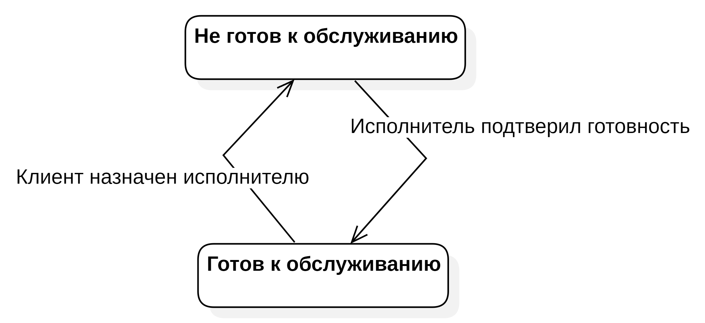

# Бизнес-роли пользователей системы

## Краткое описание ролей

### Основные роли

| Роль | Пример | Описание | Ценность | Взаимодействие |
|------|--------|----------|----------|----------------|
| Наблюдатель очереди | Незарегистрированный пользователь, специальный контролёр, табло, внешний сайт | Только чтение, не может менять данные и не имеет места в очереди | Видеть текущее состояние очереди без входа | Публичная страница, API, экран
| Неавторизованный клиент | Новый клиент | Клиент, который изъявил желание встать в очередь | Удобным способом занять своё место в очереди | Веб-форма, приложение, киоск |
| Клиент очереди | Студент, Посетитель МФЦ, Пациент клиники | Основной потребитель услуги | Физически не ждать в очереди, видеть свой статус | Веб-форма, приложение, киоск |
| Исполнитель услуги | Преподаватель, Сотрудник МФЦ, Врач, Оператор окна | Работает только с вызванным клиентом. Видит всю очередь и информацию о текущем клиенте, подтверждает завершение обслуживания. Для получения следующего клиента должен подтвердить готовность к обслуживанию. В одной очереди их может быть несколько | Предоставление данных о клиенте | Карточка клиента, форма, интерфейс
| Оператор | Ассистент, Регистратор, Администратор зала, Система | Управляет текущим состоянием существующей очереди, не обязательно обслуживает. Может вызывать к исполнителям, перемещать и удалять любого клиента в очереди. В одной очереди их может быть несколько | Удобное и гибкое управление потоком | Панель вызова, управление очередью
| Администратор | Техническая поддержка, IT-специалист, Старший менеджер | Управляет конфигурацией очереди. Инициализирует новую очередь, настраивает её поведение, закрывает сессию очереди. Назначает Операторов и Исполнителей | Гибкая настройка и мониторинг | Панель настроек, пользователи

### Комбинированные роли
| Наименование | Описание |
|--------------|----------|
| Оператор + Исполнитель услуги | Комбинирует в себе все права, возможности и ответственность обеих ролей. Может как вызывать клиента (ко всем исполнителям, а не именно к себе), так и обслуживать клиента (предварительно подтвердив готовность как исполнитель).

## Полное описание ролей

### Исполнитель услуги

Одной из ключевых ролей в архитектуре системы является исполнитель услуги — сотрудник точки обслуживания, осуществляющий непосредственное взаимодействие с клиентом в рамках процесса оказания услуги. В контексте данной работы рассматривается исключительно взаимодействие исполнителя с системой управления очередью, без детализации самого оказания услуги.  
  
Система поддерживает работу нескольких исполнителей в рамках одной очереди, что обеспечивает параллелизм обслуживания клиентов и повышает пропускную способность точки обслуживания.  
  
Для предотвращения конфликтов при распределении клиентов между сотрудниками реализован механизм управления статусом готовности. Исполнитель может приступить к обслуживанию только после явного подтверждения своей готовности к оказанию услуги в системе. Сотрудник, не переведённый в состояние готовности, исключается из списка доступных исполнителей и не может быть назначен на обслуживание нового клиента.  
  
Назначение клиента, занимающего первую позицию в очереди, осуществляется автоматически системой или вручную оператором очереди. В ситуации, когда готовность подтвердили несколько исполнителей одновременно, система осуществляет выбор клиента случайно. После назначения исполнитель получает соответствующее уведомление и доступ к минимально необходимому набору данных о клиенте, требуемых для оказания услуги. На период обслуживания клиента исполнитель автоматически переводится в состояние «не готов» и теряет возможность его смены до завершения текущей сессии.  

Процесс обслуживания инициируется подтверждением явки клиента со стороны исполнителя. В случае неявки клиента в отведённый временной интервал исполнитель имеет возможность зафиксировать факт отсутствия, что приводит к автоматическому уведомлению клиента и исключению его талона из очереди. Система при этом разрывает связь клиента с исполнителем, и возвращает сотруднику возможность вновь подтвердить свою готовность к работе. В ходе оказания услуги система предоставляет исполнителю метрики в реальном времени, включая текущую длительность обслуживания.  
  
По завершении обслуживания исполнитель фиксирует факт оказания услуги в системе, после чего происходит автоматический разрыв связи клиента с исполнителем, а сотрудник получает возможность вновь подтвердить свою готовность к работе. Помимо операционного функционала, система предоставляет исполнителю доступ к персональной аналитике: количеству клиентов в очереди, собственному среднему времени обслуживания и общему числу успешно завершённых обслуживаний.  
  
Доступ к функционалу роли исполнителя осуществляется после успешной аутентификации по учётным данным, сформированным администратором системы при создании учётной записи сотрудника.  
