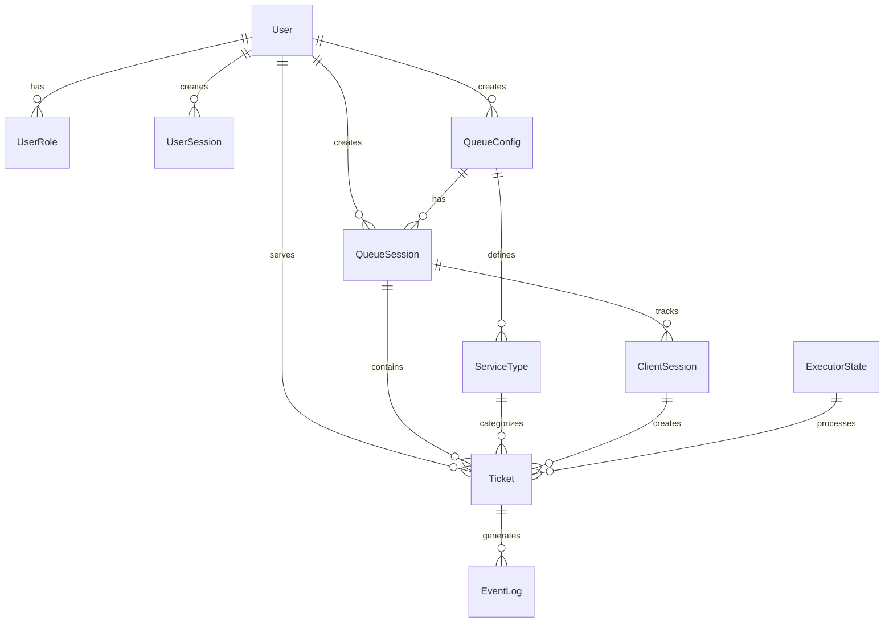

# Документация бэкенда Virtual Queue Management System (VQMS) - Часть 1: Обзор архитектуры

## Введение

Virtual Queue Management System (VQMS) - это система управления виртуальными очередями, предназначенная для автоматизации процессов обслуживания клиентов в различных организациях (банки, медицинские учреждения, госучреждения). Бэкенд системы реализован на платформе .NET 10.0 с использованием современных архитектурных подходов.

## Технологический стек

### Основные технологии
- **Платформа**: .NET 10.0 (ASP.NET Core)
- **Язык программирования**: C# 12.0
- **База данных**: PostgreSQL 16+ с использованием Entity Framework Core 8.0
- **Контейнеризация**: Docker + Docker Compose
- **Логирование**: Serilog с выводом в консоль
- **Документация API**: Swagger/OpenAPI 3.0
- **Аутентификация**: Bearer Token с кастомной реализацией
- **События**: MediatR для обработки доменных событий

### Вспомогательные библиотеки
- **Entity Framework Core**: ORM для работы с PostgreSQL
- **Npgsql**: PostgreSQL провайдер для EF Core
- **MediatR**: Реализация паттерна Mediator для событий
- **Serilog**: Структурированное логирование
- **AspNetCore.HealthChecks**: Проверки здоровья приложения
- **Swashbuckle**: Генерация Swagger документации

## Архитектурный стиль

Система построена по принципам **Clean Architecture** (Чистой архитектуры) с четким разделением на слои:

```text
┌─────────────────────────────────────────────────┐
│                    API Layer                     │
│  (Endpoints, Middleware, Controllers)           │
└─────────────────────────────────────────────────┘
                       │
┌─────────────────────────────────────────────────┐
│              Application Layer                   │
│  (Services, DTOs, Events, Business Logic)       │
└─────────────────────────────────────────────────┘
                       │
┌─────────────────────────────────────────────────┐
│                Domain Layer                      │
│  (Entities, Value Objects, Interfaces, Enums)   │
└─────────────────────────────────────────────────┘
                       │
┌─────────────────────────────────────────────────┐
│             Infrastructure Layer                 │
│  (DbContext, Security, External Services)       │
└─────────────────────────────────────────────────┘
```

### Ключевые принципы
1. **Зависимость внутрь**: Внешние слои зависят от внутренних, но не наоборот
2. **Инверсия зависимостей**: Абстракции не зависят от деталей
3. **Разделение ответственности**: Каждый слой имеет четко определенную зону ответственности
4. **Тестируемость**: Архитектура позволяет легко тестировать компоненты изолированно

## Структура проекта

### Слои и их назначение

#### 1. Domain Layer (`backend/src/Domain/`)
**Назначение**: Содержит бизнес-логику и основные концепции предметной области.

**Структура**:  
- `Entities/` - Доменные сущности (User, Ticket, QueueSession и др.)  
- `Enums/` - Перечисления (TicketStatus, SessionStatus, EventType)  
- `Interfaces/` - Абстракции для инфраструктурных сервисов  
- `DTOs/` - Внутренние DTO для передачи данных между слоями  

**Ключевые сущности**:  
- `User` - Пользователи системы (администраторы, операторы)  
- `QueueConfig` - Конфигурация очереди  
- `QueueSession` - Сессия работы очереди  
- `Ticket` - Талон (запись в очереди)  
- `ServiceType` - Тип услуги  
- `ExecutorState` - Состояние исполнителя (оператора)  
- `ClientSession` - Сессия клиента  
- `EventLog` - Лог событий системы  

#### 2. Application Layer (`backend/src/Application/`)
**Назначение**: Содержит бизнес-правила и координацию работы доменных объектов.

**Структура**:  
- `Services/` - Сервисы приложения (TicketService, UserService и др.)  
- `DTOs/` - Data Transfer Objects для API  
- `Events/` - Доменные события и их обработчики  
- `DependencyInjection/` - Регистрация сервисов приложения  

**Ключевые сервисы**:  
- `TicketService` - Управление талонами (создание, вызов, обслуживание)  
- `QueueSessionService` - Управление сессиями очереди  
- `UserService` - Управление пользователями и аутентификация  
- `ClientSessionService` - Управление клиентскими сессиями  
- `ExecutorStateService` - Управление состоянием исполнителей  

#### 3. Infrastructure Layer (`backend/src/Infrastructure/`)
**Назначение**: Реализация внешних зависимостей и инфраструктурных сервисов.

**Структура**:  
- `Data/` - Работа с базой данных (DbContext, конвертеры)  
- `Security/` - Сервисы безопасности (TokenService, PasswordHasher)  
- `DependencyInjection/` - Регистрация инфраструктурных сервисов  

**Ключевые компоненты**:  
- `AppDbContext` - Контекст базы данных Entity Framework Core  
- `TokenService` - Генерация и верификация токенов  
- `PasswordHasher` - Хеширование паролей  
- `TokenValidationService` - Валидация токенов аутентификации  

#### 4. API Layer (`backend/src/Api/`)
**Назначение**: Предоставление HTTP API и обработка запросов.

**Структура**:  
- `Endpoints/` - Minimal API endpoints (Auth, Ticket, Queue и др.)  
- `Middleware/` - Промежуточное ПО (аутентификация)  
- `Helpers/` - Вспомогательные классы  
- `Program.cs` - Точка входа и конфигурация приложения  

**Ключевые endpoints**:  
- `AuthEndpoints` - Аутентификация и управление сессиями  
- `TicketEndpoints` - Операции с талонами  
- `QueueSessionEndpoints` - Управление сессиями очереди  
- `UserEndpoints` - Управление пользователями  
- `ExecutorStateEndpoints` - Управление состоянием исполнителей  

## Поток данных

### Типичный запрос
1. **HTTP Request** -> API Endpoint
2. **Authentication Middleware** -> Валидация токена
3. **Endpoint Handler** -> Вызов Application Service
4. **Application Service** -> Работа с Domain Entities
5. **Infrastructure** -> Сохранение в БД через DbContext
6. **Domain Events** -> Публикация событий через MediatR
7. **Response** -> Возврат DTO клиенту

## Модель данных

### Основные отношения


### Ключевые ограничения
- Одна активная сессия очереди на конфигурацию  
- Уникальные номера талонов в рамках сессии  
- Автоматическая отмена предыдущих активных талонов клиента  
- Проверка целостности состояний исполнителей  

## Конфигурация и развертывание

### Файлы конфигурации
- `appsettings.json` - Основные настройки приложения  
- `Dockerfile` - Конфигурация Docker образа  
- `docker-compose.yml` - Оркестрация сервисов  

### Переменные окружения
- `ASPNETCORE_ENVIRONMENT` - Окружение выполнения  
- `ConnectionStrings__DefaultConnection` - Строка подключения к PostgreSQL  
- `Serilog__MinimumLevel` - Уровень логирования  

### База данных
- **СУБД**: PostgreSQL 16+  
- **Миграции**: Управление через SQL скрипты (не EF Core Migrations)  
- **Инициализация**: Скрипты в `infra/db/init/`  
- **Индексы**: Оптимизированы для частых запросов очереди  

## Безопасность

### Аутентификация
- **Типы токенов**: Bearer tokens для пользователей и клиентов  
- **Валидация**: Кастомный TokenValidationService  
- **Сессии**: UserSession для пользователей, ClientSession для клиентов  
- **Роли**: RBAC (Role-Based Access Control) с ролями ADMIN, OPERATOR, EXECUTOR  

### Авторизация
- **Endpoint-level**: Проверка ролей в middleware и endpoints  
- **Resource-level**: Проверка прав доступа к конкретным ресурсам  
- **Анонимный доступ**: Некоторые endpoints публичные (создание талона)  

### Защита данных
- **Пароли**: Хеширование с использованием современного алгоритма  
- **Токены**: Хеширование для безопасного хранения  
- **SQL Injection**: Защита через параметризованные запросы EF Core  
- **CORS**: Настроен для разрешения всех источников (в разработке)  

## Мониторинг и логирование

### Логирование
- **Фреймворк**: Serilog с структурным логированием  
- **Выходы**: Console (разработка), планируется добавление файлов и Elasticsearch  
- **Уровни**: Information, Warning, Error с контекстным обогащением  

### Health Checks
- **Endpoint**: `/healthz` и `/api/health`  
- **Проверки**: Состояние подключения к БД  
- **Интеграция**: AspNetCore.HealthChecks.NpgSql  

### Метрики
- **Встроенные**: ASP.NET Core метрики  
- **Кастомные**: События домена для отслеживания бизнес-метрик  
- **EventLog**: Таблица для аудита всех значимых действий  

## Масштабируемость

### Горизонтальное масштабирование
- **Stateless**: API слой не имеет состояния  
- **База данных**: PostgreSQL с репликацией  
- **Кэширование**: Планируется внедрение Redis для очередей  

### Производительность
- **Асинхронность**: Все операции async/await  
- **Индексы**: Оптимизированные индексы для частых запросов  
- **Пагинация**: Поддержка пагинации для списков  
- **Оптимистическая блокировка**: Version поле для предотвращения конфликтов  

## Заключение

Бэкенд VQMS представляет собой современное, хорошо структурированное приложение, построенное по принципам Clean Architecture. Система демонстрирует хорошее разделение ответственности, поддерживаемость и расширяемость. Использование современных технологий .NET экосистемы обеспечивает надежность и производительность.

В следующих частях документации будут подробно рассмотрены:
1. Детали реализации каждого слоя  
2. API endpoints и их спецификации  
3. Интеграции и события системы  
4. Развертывание и эксплуатация  