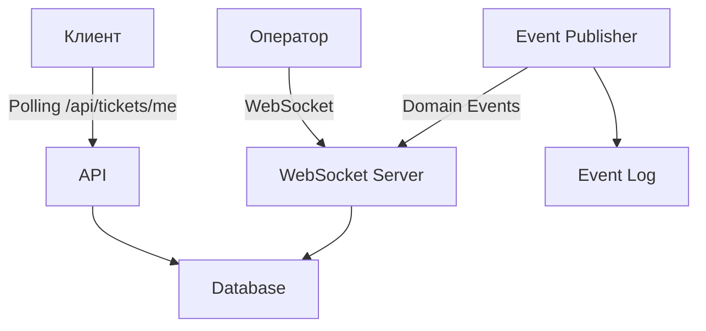

# Документация бэкенда Virtual Queue Management System (VQMS) - Часть 3: API и интеграции

## API Overview

### Базовый URL
```
http://localhost:8080 (локальная разработка)
https://api.vqms.example.com (продакшен)
```

### Версионирование
Текущая версия API: **v1** (неявное версионирование через префиксы endpoints)

### Формат данных
- **Content-Type**: `application/json` для запросов и ответов
- **Кодировка**: UTF-8
- **Даты**: ISO 8601 в UTC (`2024-01-15T10:30:00Z`)

### Аутентификация
- **Схема**: Bearer Token
- **Заголовок**: `Authorization: Bearer <token>`
- **Типы токенов**:
  - **User Token**: Для администраторов, операторов, исполнителей
  - **Client Token**: Для клиентов (получается при создании талона)

### Ответы API
- **Успех**: HTTP 200-299 с данными в теле ответа
- **Ошибки**: Соответствующий HTTP статус с сообщением об ошибке
- **Структура ошибки**:
```json
{
  "type": "https://tools.ietf.org/html/rfc7231#section-6.5.1",
  "title": "Bad Request",
  "status": 400,
  "detail": "DeviceFingerprint обязателен.",
  "instance": "/api/tickets"
}
```

## Endpoints Группы

### 1. Аутентификация и управление сессиями

#### POST /api/auth/login
**Назначение**: Аутентификация пользователя (администратор, оператор, исполнитель).

**Запрос**:
```json
{
  "login": "admin",
  "password": "password123"
}
```

**Ответ** (успех):
```json
{
  "token": "eyJhbGciOiJIUzI1NiIsInR5cCI6IkpXVCJ9...",
  "userId": 1,
  "login": "admin",
  "fullName": "Администратор Системы",
  "roles": ["ADMIN", "OPERATOR"],
  "expiresIn": 86400
}
```

**Ошибки**:
- `400 Bad Request`: Неверный формат запроса
- `401 Unauthorized`: Неверные учетные данные
- `403 Forbidden`: Пользователь неактивен

#### POST /api/auth/logout
**Назначение**: Завершение сессии пользователя.

**Заголовки**: `Authorization: Bearer <token>`

**Ответ** (успех):
```json
{
  "message": "Сессия успешно завершена"
}
```

#### GET /api/auth/me
**Назначение**: Получение информации о текущем аутентифицированном пользователе.

**Заголовки**: `Authorization: Bearer <token>`

**Ответ**:
```json
{
  "userId": 1,
  "login": "admin",
  "fullName": "Администратор Системы",
  "email": "admin@example.com",
  "roles": ["ADMIN", "OPERATOR"],
  "isActive": true,
  "createdAt": "2024-01-01T00:00:00Z"
}
```

### 2. Управление талонами (Tickets)

#### POST /api/tickets
**Назначение**: Создание нового талона (публичный endpoint).

**Запрос**:
```json
{
  "deviceFingerprint": "abc123def456",
  "clientName": "Иван",
  "clientSurname": "Иванов",
  "serviceTypeId": 1,
  "ipAddress": "192.168.1.1",
  "userAgent": "Mozilla/5.0..."
}
```

**Ответ** (успех, 201 Created):
```json
{
  "ticket": {
    "id": 1001,
    "queueSessionId": 5,
    "ticketNumber": "A015",
    "clientName": "Иван",
    "clientSurname": "Иванов",
    "serviceTypeId": 1,
    "serviceTypeName": "Консультация",
    "serviceLetter": "A",
    "sortOrder": 15000,
    "priorityLevel": 0,
    "status": "Waiting",
    "version": 1,
    "createdAt": "2024-01-15T10:30:00Z",
    "calledAt": null,
    "serviceStartedAt": null,
    "serviceEndedAt": null,
    "servedByUserId": null,
    "servedByUserName": null,
    "cancelReason": null,
    "positionInQueue": 3
  },
  "sessionToken": "client_token_abc123"
}
```

**Особенности**:
- Публичный endpoint, не требует аутентификации
- `deviceFingerprint` используется для идентификации устройства клиента
- Автоматически создает/использует клиентскую сессию
- Возвращает токен сессии для последующих запросов клиента

#### GET /api/tickets/me
**Назначение**: Получение активного талона текущего клиента.

**Заголовки**: `Authorization: Bearer <client_token>`

**Ответ**:
```json
{
  "id": 1001,
  "queueSessionId": 5,
  "ticketNumber": "A015",
  "clientName": "Иван",
  "clientSurname": "Иванов",
  "serviceTypeId": 1,
  "serviceTypeName": "Консультация",
  "serviceLetter": "A",
  "sortOrder": 15000,
  "priorityLevel": 0,
  "status": "Waiting",
  "version": 1,
  "createdAt": "2024-01-15T10:30:00Z",
  "calledAt": null,
  "serviceStartedAt": null,
  "serviceEndedAt": null,
  "servedByUserId": null,
  "servedByUserName": null,
  "cancelReason": null,
  "positionInQueue": 3,
  "estimatedWaitTimeMinutes": 15,
  "waitingTicketsCount": 2
}
```

#### POST /api/tickets/{ticketId}/call
**Назначение**: Вызов талона оператором (изменение статуса на Called).

**Требования**: Роли OPERATOR или ADMIN

**Запрос**:
```json
{
  "executorId": 3
}
```

**Ответ**:
```json
{
  "id": 1001,
  "ticketNumber": "A015",
  "status": "Called",
  "calledAt": "2024-01-15T10:35:00Z",
  "calledByUserId": 3,
  "calledByUserName": "Оператор Петров"
}
```

#### POST /api/tickets/{ticketId}/start-service
**Назначение**: Начало обслуживания талона.

**Требования**: Роли OPERATOR, EXECUTOR или ADMIN

**Ответ**:
```json
{
  "id": 1001,
  "ticketNumber": "A015",
  "status": "Serving",
  "serviceStartedAt": "2024-01-15T10:36:00Z",
  "servedByUserId": 3,
  "servedByUserName": "Оператор Петров"
}
```

#### POST /api/tickets/{ticketId}/complete-service
**Назначение**: Завершение обслуживания талона.

**Требования**: Роли OPERATOR, EXECUTOR или ADMIN

**Запрос**:
```json
{
  "success": true
}
```

**Ответ**:
```json
{
  "id": 1001,
  "ticketNumber": "A015",
  "status": "Served",
  "serviceEndedAt": "2024-01-15T10:40:00Z",
  "serviceDurationMinutes": 4
}
```

#### POST /api/tickets/{ticketId}/cancel
**Назначение**: Отмена талона.

**Требования**: 
- Для клиентов: только свой талон (через /api/tickets/me/cancel)
- Для операторов: любой талон с ролью OPERATOR или ADMIN

**Запрос**:
```json
{
  "reason": "Клиент не явился"
}
```

**Ответ**:
```json
{
  "id": 1001,
  "ticketNumber": "A015",
  "status": "Cancelled",
  "cancelReason": "Клиент не явился",
  "cancelledAt": "2024-01-15T10:37:00Z"
}
```

#### GET /api/tickets/queue
**Назначение**: Получение текущей очереди талонов.

**Параметры запроса**:
- `queueSessionId` (опционально) - ID сессии очереди
- `sorted` (boolean, default: false) - Сортировка по приоритету

**Ответ**:
```json
{
  "tickets": [
    {
      "id": 1001,
      "ticketNumber": "A015",
      "clientName": "Иван",
      "clientSurname": "Иванов",
      "serviceTypeName": "Консультация",
      "status": "Waiting",
      "priorityLevel": 0,
      "createdAt": "2024-01-15T10:30:00Z",
      "position": 1,
      "estimatedWaitTimeMinutes": 5
    },
    // ... другие талоны
  ],
  "totalCount": 15,
  "waitingCount": 8,
  "servingCount": 2,
  "calledCount": 1,
  "averageWaitTimeMinutes": 12
}
```

#### GET /api/tickets/all
**Назначение**: Получение всех талонов (для администраторов и операторов).

**Требования**: Роли ADMIN или OPERATOR

**Параметры запроса**:
- `queueSessionId` (опционально) - ID сессии очереди
- `sorted` (boolean, default: false) - Сортировка по приоритету
- `status` (опционально) - Фильтр по статусу
- `page` (int, default: 1) - Номер страницы
- `pageSize` (int, default: 50) - Размер страницы

**Ответ**:
```json
{
  "tickets": [...],
  "pagination": {
    "page": 1,
    "pageSize": 50,
    "totalPages": 3,
    "totalCount": 125
  }
}
```

### 3. Управление сессиями очереди (Queue Sessions)

#### GET /api/queue-sessions/active
**Назначение**: Получение активной сессии очереди.

**Ответ**:
```json
{
  "id": 5,
  "name": "Утренняя сессия",
  "description": "Обслуживание с 9:00 до 13:00",
  "status": "OPEN",
  "startedAt": "2024-01-15T09:00:00Z",
  "closedAt": null,
  "queueConfig": {
    "id": 1,
    "name": "Основная очередь",
    "isServiceTypeEnabled": true,
    "distributionMode": "ROUND_ROBIN"
  },
  "statistics": {
    "totalTickets": 25,
    "waitingTickets": 8,
    "servedTickets": 12,
    "averageServiceTimeMinutes": 7
  }
}
```

#### POST /api/queue-sessions
**Назначение**: Создание новой сессии очереди.

**Требования**: Роль ADMIN

**Запрос**:
```json
{
  "queueConfigId": 1,
  "name": "Вечерняя сессия",
  "description": "Обслуживание с 17:00 до 21:00"
}
```

**Ответ** (201 Created):
```json
{
  "id": 6,
  "name": "Вечерняя сессия",
  "description": "Обслуживание с 17:00 до 21:00",
  "status": "DRAFT",
  "queueConfigId": 1,
  "createdByUserId": 1,
  "createdAt": "2024-01-15T16:00:00Z"
}
```

#### POST /api/queue-sessions/{sessionId}/open
**Назначение**: Открытие сессии очереди.

**Требования**: Роль ADMIN или OPERATOR

**Ответ**:
```json
{
  "id": 6,
  "status": "OPEN",
  "startedAt": "2024-01-15T17:00:00Z",
  "message": "Сессия успешно открыта"
}
```

#### POST /api/queue-sessions/{sessionId}/close
**Назначение**: Закрытие сессии очереди.

**Требования**: Роль ADMIN или OPERATOR

**Ответ**:
```json
{
  "id": 5,
  "status": "CLOSED",
  "closedAt": "2024-01-15T13:00:00Z",
  "message": "Сессия успешно закрыта"
}
```

#### POST /api/queue-sessions/{sessionId}/pause
**Назначение**: Приостановка сессии очереди.

**Требования**: Роль ADMIN или OPERATOR

**Ответ**:
```json
{
  "id": 5,
  "status": "PAUSED",
  "message": "Сессия приостановлена"
}
```

#### POST /api/queue-sessions/{sessionId}/resume
**Назначение**: Возобновление сессии очереди.

**Требования**: Роль ADMIN или OPERATOR

**Ответ**:
```json
{
  "id": 5,
  "status": "OPEN",
  "message": "Сессия возобновлена"
}
```

### 4. Управление конфигурациями очереди (Queue Configs)

#### GET /api/queue-configs
**Назначение**: Получение списка конфигураций очередей.

**Требования**: Роль ADMIN

**Ответ**:
```json
[
  {
    "id": 1,
    "name": "Основная очередь",
    "description": "Основная очередь обслуживания",
    "isActive": true,
    "isServiceTypeEnabled": true,
    "distributionMode": "ROUND_ROBIN",
    "averageServiceTimeMinutes": 10,
    "maxWaitingTimeMinutes": 60,
    "createdByUserId": 1,
    "createdAt": "2024-01-01T00:00:00Z",
    "serviceTypes": [
      {
        "id": 1,
        "name": "Консультация",
        "letter": "A",
        "basePriorityLevel": 0
      },
      {
        "id": 2,
        "name": "Оформление документов",
        "letter": "B",
        "basePriorityLevel": 0
      }
    ]
  }
]
```

#### POST /api/queue-configs
**Назначение**: Создание новой конфигурации очереди.

**Требования**: Роль ADMIN

**Запрос**:
```json
{
  "name": "Экспресс-очередь",
  "description": "Быстрое обслуживание простых запросов",
  "isServiceTypeEnabled": false,
  "distributionMode": "PRIORITY",
  "averageServiceTimeMinutes": 5,
  "maxWaitingTimeMinutes": 30
}
```

**Ответ** (201 Created):
```json
{
  "id": 2,
  "name": "Экспресс-очередь",
  "description": "Быстрое обслуживание простых запросов",
  "isActive": true,
  "isServiceTypeEnabled": false,
  "distributionMode": "PRIORITY",
  "averageServiceTimeMinutes": 5,
  "maxWaitingTimeMinutes": 30,
  "createdByUserId": 1,
  "createdAt": "2024-01-15T14:00:00Z"
}
```

#### PUT /api/queue-configs/{configId}
**Назначение**: Обновление конфигурации очереди.

**Требования**: Роль ADMIN

#### DELETE /api/queue-configs/{configId}
**Назначение**: Удаление конфигурации очереди (мягкое удаление).

**Требования**: Роль ADMIN

### 5. Управление типами услуг (Service Types)

#### GET /api/service-types
**Назначение**: Получение типов услуг для активной конфигурации.

**Параметры запроса**:
- `queueConfigId` (опционально) - ID конфигурации очереди

**Ответ**:
```json
[
  {
    "id": 1,
    "name": "Консультация",
    "letter": "A",
    "description": "Консультация по услугам",
    "basePriorityLevel": 0,
    "isActive": true,
    "sortOrder": 1
  },
  {
    "id": 2,
    "name": "Оформление документов",
    "letter": "B",
    "description": "Оформление и выдача документов",
    "basePriorityLevel": 0,
    "isActive": true,
    "sortOrder": 2
  }
]
```

#### POST /api/service-types
**Назначение**: Создание нового типа услуги.

**Требования**: Роль ADMIN

**Запрос**:
```json
{
  "queueConfigId": 1,
  "name": "Оплата услуг",
  "letter": "C",
  "description": "Прием платежей",
  "basePriorityLevel": 0,
  "sortOrder": 3
}
```

#### PUT /api/service-types/{typeId}
**Назначение**: Обновление типа услуги.

**Требования**: Роль ADMIN

#### DELETE /api/service-types/{typeId}
**Назначение**: Удаление типа услуги (мягкое удаление).

**Требования**: Роль ADMIN

### 6. Управление состоянием исполнителей (Executor States)

#### GET /api/executor-states
**Назначение**: Получение состояний всех исполнителей.

**Требования**: Роли ADMIN или OPERATOR

**Ответ**:
```json
[
  {
    "id": 1,
    "userId": 3,
    "userName": "Оператор Петров",
    "queueSessionId": 5,
    "isReady": true,
    "currentTicketId": 1001,
    "currentTicketNumber": "A015",
    "lastStatusChange": "2024-01-15T10:30:00Z",
    "statistics": {
      "ticketsServedToday": 12,
      "averageServiceTimeMinutes": 6
    }
  }
]
```

#### POST /api/executor-states/ready
**Назначение**: Установка состояния "готов" для текущего исполнителя.

**Требования**: Роли OPERATOR или EXECUTOR

**Ответ**:
```json
{
  "userId": 3,
  "isReady": true,
  "lastStatusChange": "2024-01-15T10:35:00Z",
  "message": "Состояние обновлено: готов принимать талоны"
}
```

#### POST /api/executor-states/not-ready
**Назначение**: Установка состояния "не готов" для текущего исполнителя.

**Требования**: Роли OPERATOR или EXECUTOR

**Ответ**:
```json
{
  "userId": 3,
  "isReady": false,
  "lastStatusChange": "2024-01-15T10:36:00Z",
  "message": "Состояние обновлено: не готов принимать талоны"
}
```

#### POST /api/executor-states/take-next
**Назначение**: Взять следующий талон для обслуживания.

**Требования**: Роли OPERATOR или EXECUTOR

**Ответ**:
```json
{
  "executorState": {
    "userId": 3,
    "isReady": true,
    "currentTicketId": 1002
  },
  "ticket": {
    "id": 1002,
    "ticketNumber": "A016",
    "clientName": "Петр",
    "clientSurname": "Петров",
    "status": "Called",
    "calledAt": "2024-01-15T10:37:00Z"
  }
}
```

### 7. Управление пользователями (Users)

#### GET /api/users
**Назначение**: Получение списка пользователей.

**Требования**: Роль ADMIN

**Параметры запроса**:
- `role` (опционально) - Фильтр по роли
- `isActive` (опционально) - Фильтр по активности

**Ответ**:
```json
[
  {
    "id": 1,
    "login": "admin",
    "fullName": "Администратор Системы",
    "email": "admin@example.com",
    "isActive": true,
    "roles": ["ADMIN", "OPERATOR"],
    "createdAt": "2024-01-01T00:00:00Z",
    "lastLoginAt": "2024-01-15T09:00:00Z"
  }
]
```

#### POST /api/users
**Назначение**: Создание нового пользователя.

**Требования**: Роль ADMIN

**Запрос**:
```json
{
  "login": "operator2",
  "password": "securepassword123",
  "fullName": "Оператор Сидоров",
  "email": "operator2@example.com",
  "roles": ["OPERATOR"]
}
```

**Ответ** (201 Created):
```json
{
  "id": 4,
  "login": "operator2",
  "fullName": "Оператор Сидоров",
  "email": "operator2@example.com",
  "isActive": true,
  "roles": ["OPERATOR"],
  "createdAt": "2024-01-15T14:00:00Z"
}
```

#### PUT /api/users/{userId}
**Назначение**: Обновление пользователя.

**Требования**: Роль ADMIN

#### POST /api/users/{userId}/deactivate
**Назначение**: Деактивация пользователя.

**Требования**: Роль ADMIN

#### POST /api/users/{userId}/activate
**Назначение**: Активация пользователя.

**Требования**: Роль ADMIN

### 8. Health Checks и мониторинг

#### GET /healthz
**Назначение**: Проверка здоровья приложения (Kubernetes liveness probe).

**Ответ**:
```json
{
  "status": "Healthy",
  "checks": {
    "database": "Healthy",
    "memory": "Healthy"
  },
  "timestamp": "2024-01-15T10:30:00Z",
  "version": "1.0.0"
}
```

#### GET /api/health
**Назначение**: Детальная проверка здоровья с метриками.

**Требования**: Роль ADMIN (или внутренний мониторинг)

**Ответ**:
```json
{
  "status": "Healthy",
  "uptime": "5d 3h 15m",
  "database": {
    "status": "Connected",
    "latencyMs": 12,
    "activeConnections": 5
  },
  "memory": {
    "totalBytes": 1073741824,
    "usedBytes": 268435456,
    "percentage": 25
  },
  "requests": {
    "total": 12500,
    "perMinute": 45,
    "errorRate": 0.02
  }
}
```

#### GET /
**Назначение**: Корневой endpoint с информацией о API.

**Ответ**:
```json
{
  "message": "Welcome to VQMS API",
  "version": "1.0.0",
  "documentation": "/swagger",
  "health": "/healthz",
  "timestamp": "2024-01-15T10:30:00Z"
}
```

## Middleware

### AuthenticationMiddleware
**Назначение**: Аутентификация запросов по Bearer token.

**Логика работы**:
1. Извлечение токена из заголовка `Authorization`
2. Пропуск запроса, если токен отсутствует (анонимный доступ)
3. Валидация токена через `ITokenValidationService`
4. Создание `ClaimsPrincipal` и установка в `HttpContext.User`
5. Добавление информации в `HttpContext.Items` для доступа в endpoints

**Код**:
```csharp
public async Task InvokeAsync(HttpContext context, ITokenValidationService tokenValidationService)
{
    var token = ExtractTokenFromHeader(context.Request.Headers);
    
    if (!string.IsNullOrEmpty(token))
    {
        var authResult = await tokenValidationService.ValidateTokenAsync(token);
        if (authResult != null)
        {
            var principal = CreateClaimsPrincipal(authResult);
            context.User = principal;
            
            // Дополнительная информация для endpoints
            context.Items["AuthEntityId"] = authResult.EntityId;
            context.Items["AuthEntityType"] = authResult.EntityType;
            context.Items["AuthRoles"] = authResult.Roles;
        }
        else
        {
            context.Response.StatusCode = 401;
            await context.Response.WriteAsync("Unauthorized: Invalid or expired token");
            return;
        }
    }
    
    await _next(context);
}
```

### Другие middleware
- **Serilog Request Logging**: Логирование HTTP запросов
- **CORS Middleware**: Разрешение кросс-доменных запросов
- **HttpsRedirection**: Перенаправление HTTP → HTTPS
- **Exception Handling**: Глобальная обработка исключений (планируется)

## Интеграции

### 1. Интеграция с базой данных (PostgreSQL)

#### Схема базы данных
```sql
-- Основные таблицы
users
queue_configs
queue_sessions
tickets
service_types
executor_states
client_sessions
event_logs
roles
user_roles
user_sessions

-- Индексы для оптимизации
idx_ticket_session_status
idx_ticket_client_session
idx_session_queue_status
idx_user_login
idx_user_sessions_token
```

#### Миграции
Управление схемой через SQL скрипты в `infra/db/init/`:
- `01-init.sql` - Инициализация схемы
- `02-seed-data.sql` - Начальные данные (роли, администратор)
- `03-indexes.sql` - Оптимизационные индексы

#### Подключение
```csharp
services.AddDbContext<AppDbContext>(options =>
    options.UseNpgsql(configuration.GetConnectionString("DefaultConnection")));
```

### 2. Интеграция с фронтендом

#### Клиентский интерфейс
- **Технологии**: Vue.js 3, Vite, TypeScript
- **Взаимодействие**: REST API с Bearer token аутентификацией
- **WebSocket**: Планируется для real-time обновлений очереди

#### Операторский интерфейс
- **Технологии**: Vue.js 3, Vite, TypeScript
- **Функциональность**: Управление очередью, вызов талонов, управление исполнителями
- **Real-time**: Обновление состояния через polling (планируется WebSocket)

### 3. Интеграция с внешними системами

#### Система оповещений (SMS/Email)
**Статус**: Планируется

**Сценарии**:
1. Оповещение о приближении очереди
2. Оповещение о вызове талона
3. Статистические отчеты

**Интерфейс**:
```csharp
public interface INotificationService
{
    Task SendTicketCalledNotification(int ticketId, string phoneNumber);
    Task SendQueuePositionNotification(int clientSessionId, int position);
}
```

#### Система аналитики
**Статус**: Планируется

**Метрики**:
- Среднее время ожидания
- Загрузка операторов
- Пиковые часы нагрузки
- Удовлетворенность клиентов

**Интеграция**: Отправка событий в Kafka/Redis для обработки аналитическим модулем

#### Система аудита
**Реализовано**: Таблица `event_logs`

**События**:
- Создание, изменение, отмена талонов
- Открытие/закрытие сессий
- Действия пользователей
- Изменения состояний исполнителей

### 4. Real-time обновления

#### Текущая реализация
- **Polling**: Клиенты опрашивают `/api/tickets/me` каждые 10-30 секунд
- **Server-Sent Events (SSE)**: Планируется для более эффективных обновлений
- **WebSocket**: Планируется для операторского интерфейса

#### Архитектура real-time


## Безопасность API

### Защита endpoints

#### Ролевая модель
```csharp
// Пример проверки ролей в endpoint
private static async Task<IResult> GetAllTickets(ClaimsPrincipal user, ...)
{
    var userId = user.GetUserId();
    if (userId == null)
        return Results.Unauthorized();
        
    if (!user.IsInAnyRole("ADMIN", "OPERATOR"))
        return Results.Forbid();
        
    // Логика endpoint
}
```

#### Валидация входных данных
- **Model Validation**: Data annotations в DTO
- **Бизнес-валидация**: В сервисах приложения
- **SQL Injection**: Защита через параметризованные запросы EF Core

### Rate Limiting
**Статус**: Планируется

**Ограничения**:
- Публичные endpoints: 100 запросов/час на IP
- Аутентифицированные пользователи: 1000 запросов/час
- Администраторы: без ограничений

### Защита от атак
- **CORS**: Настроен для контролируемых доменов
- **HTTPS**: Обязательно в продакшене
- **CSRF**: Не требуется для API (используется Bearer token)
- **XSS**: Защита через правильную сериализацию JSON

## Тестирование API

### Инструменты
- **Swagger UI**: `/swagger` для интерактивного тестирования
- **Postman**: Коллекция для ручного тестирования
- **Unit Tests**: xUnit для тестирования сервисов
- **Integration Tests**: TestServer для тестирования endpoints

### Пример теста endpoint
```csharp
[Fact]
public async Task CreateTicket_ValidRequest_ReturnsCreated()
{
    // Arrange
    var client = _factory.CreateClient();
    var request = new CreateTicketWithDeviceDto
    {
        DeviceFingerprint = "test-device-123",
        ClientName = "Test",
        ClientSurname = "User"
    };
    
    // Act
    var response = await client.PostAsJsonAsync("/api/tickets", request);
    
    // Assert
    response.StatusCode.Should().Be(HttpStatusCode.Created);
    var content = await response.Content.ReadFromJsonAsync<TicketResponse>();
    content.Should().NotBeNull();
    content.Ticket.TicketNumber.Should().NotBeNullOrEmpty();
}
```

## Деплоймент и эксплуатация

### Docker контейнеризация
```yaml
# docker-compose.yml
version: '3.8'
services:
  api:
    build: ./backend
    ports:
      - "8080:8080"
    environment:
      - ConnectionStrings__DefaultConnection=Host=db;Port=5432;Database=vqms_db;Username=vqms_user;Password=vqms_password
    depends_on:
      - db
  
  db:
    image: postgres:16
    environment:
      - POSTGRES_DB=vqms_db
      - POSTGRES_USER=vqms_user
      - POSTGRES_PASSWORD=vqms_password
    volumes:
      - postgres_data:/var/lib/postgresql/data
```

### Переменные окружения
```bash
# Обязательные
ASPNETCORE_ENVIRONMENT=Production
ConnectionStrings__DefaultConnection=Host=...;Database=...;Username=...;Password=...

# Опциональные
Serilog__MinimumLevel=Information
CORS__AllowedOrigins=https://frontend.example.com
JWT__Secret=your-secret-key
```

### Health Checks для оркестрации
- **Kubernetes Liveness Probe**: `GET /healthz`
- **Kubernetes Readiness Probe**: `GET /api/health`
- **Метрики**: Prometheus metrics endpoint (планируется)

## Мониторинг и логирование

### Структурированные логи
```json
{
  "Timestamp": "2024-01-15T10:30:00Z",
  "Level": "Information",
  "Message": "Ticket created",
  "Properties": {
    "TicketId": 1001,
    "QueueSessionId": 5,
    "ClientSessionId": 42,
    "Endpoint": "/api/tickets",
    "StatusCode": 201
  }
}
```

### Метрики производительности
- **Время ответа API**: По endpoint
- **Частота ошибок**: По типу ошибки
- **Загрузка БД**: Количество подключений, время запросов
- **Использование памяти**: Heap size, GC collections

### Алёртинг
**Условия для алёртов**:
- Ошибки 5xx > 1% за 5 минут
- Время ответа > 2 секунд для 95-го перцентиля
- Отсутствие активности более 5 минут
- Проблемы с подключением к БД

## Заключение

API VQMS предоставляет полный набор endpoints для управления виртуальными очередями. Система построена с учетом современных практик REST API design, безопасности и масштабируемости. Интеграционные возможности позволяют легко расширять систему и подключать дополнительные модули.

Ключевые преимущества API:
1. **Полнота**: Покрывает все сценарии использования системы
2. **Безопасность**: Ролевая модель, валидация, защита от атак
3. **Документированность**: Swagger UI, подробная документация
4. **Надежность**: Обработка ошибок, health checks, мониторинг
5. **Расширяемость**: Четкая архитектура для добавления новых функций

Система готова к использованию в production среде и может быть легко развернута с использованием Docker и оркестраторов типа Kubernetes.