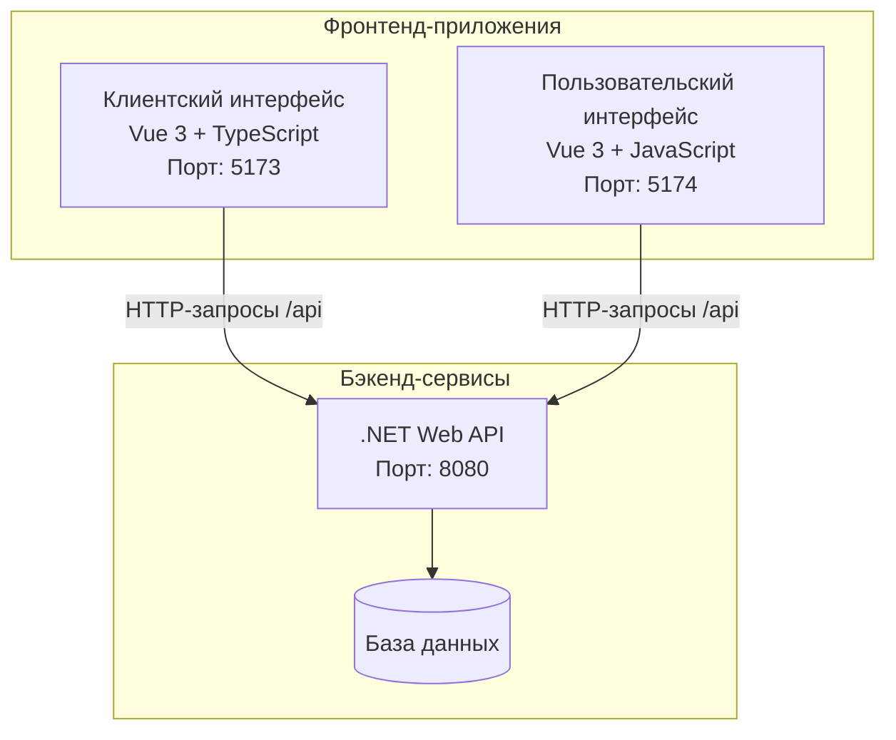

# Документация фронтенда системы управления виртуальной очередью

## Часть 1: Обзор архитектуры

### Введение
Фронтенд системы управления виртуальной очередью состоит из двух независимых веб-приложений, каждое предназначено для разных категорий пользователей:
1. **Клиентский интерфейс (client-interface)** - для клиентов (студентов), которые становятся в очередь и отслеживают свой талон.  
2. **Пользовательский интерфейс (user-interface)** - для персонала (операторов, исполнителей, администраторов), которые управляют очередью.  
  
Оба приложения построены на современном стеке Vue 3 с использованием Composition API, TypeScript (клиентский интерфейс) и JavaScript (пользовательский интерфейс).

### Архитектурная схема



### Ключевые характеристики

| Аспект | Клиентский интерфейс | Пользовательский интерфейс |
|--------|----------------------|----------------------------|
| **Целевая аудитория** | Клиенты (студенты) | Персонал (операторы, исполнители, администраторы) |
| **Технологический стек** | Vue 3, TypeScript, Pinia, Vue Router, Bootstrap 5 | Vue 3, JavaScript, Pinia, Vue Router, Bootstrap 5 |
| **Сборщик** | Vite | Vite |
| **Порт разработки** | 5173 | 5174 |
| **Аутентификация** | На основе device fingerprint + токена сессии | JWT-токен + ролевая модель |
| **Основные функции** | Создание талона, отслеживание позиции в очереди, просмотр статуса | Управление очередью, вызов клиентов, статистика, администрирование |
| **Состояние** | Pinia stores (auth, ticket) | Pinia stores (auth, operator, executor, admin) |

### Структура директорий

```
frontend/
├── client/                    # Клиентский интерфейс
│   ├── client-interface/      # Основное приложение
│   │   ├── src/
│   │   │   ├── components/    # Vue-компоненты
│   │   │   ├── composables/   # Композаблы (логика)
│   │   │   ├── stores/        # Состояние Pinia
│   │   │   ├── types/         # TypeScript-типы
│   │   │   ├── views/         # Страницы
│   │   │   └── router/        # Маршрутизация
│   │   ├── package.json
│   │   └── vite.config.js
│   └── package-lock.json
└── user/                     # Пользовательский интерфейс
    ├── user-interface/       # Основное приложение
    │   ├── src/
    │   │   ├── api/          # API-клиенты
    │   │   ├── components/   # Vue-компоненты
    │   │   ├── stores/       # Состояние Pinia
    │   │   ├── views/        # Страницы
    │   │   └── router/       # Маршрутизация
    │   ├── package.json
    │   └── vite.config.js
    └── package-lock.json
```

### Принципы проектирования

1. **Разделение ответственности** - каждый интерфейс решает свою задачу без избыточного функционала.
2. **Реактивность** - использование Vue 3 Composition API для реактивного управления состоянием.
3. **Централизованное состояние** - Pinia stores для управления глобальным состоянием.
4. **Маршрутизация на стороне клиента** - Vue Router для навигации.
5. **Адаптивный дизайн** - Bootstrap 5 для кросс-платформенной совместимости.
6. **Проксирование API** - Vite dev server проксирует запросы к бэкенду для избежания CORS.

### Следующие части документации

1. **Часть 2: Клиентский интерфейс** - детальное описание технологий, компонентов и логики.
2. **Часть 3: Пользовательский интерфейс** - ролевая модель, stores и компоненты.
3. **Часть 4: Интеграция с API** - общие подходы к работе с бэкендом.
4. **Часть 5: Развертывание и настройка** - сборка, конфигурация, запуск.

---