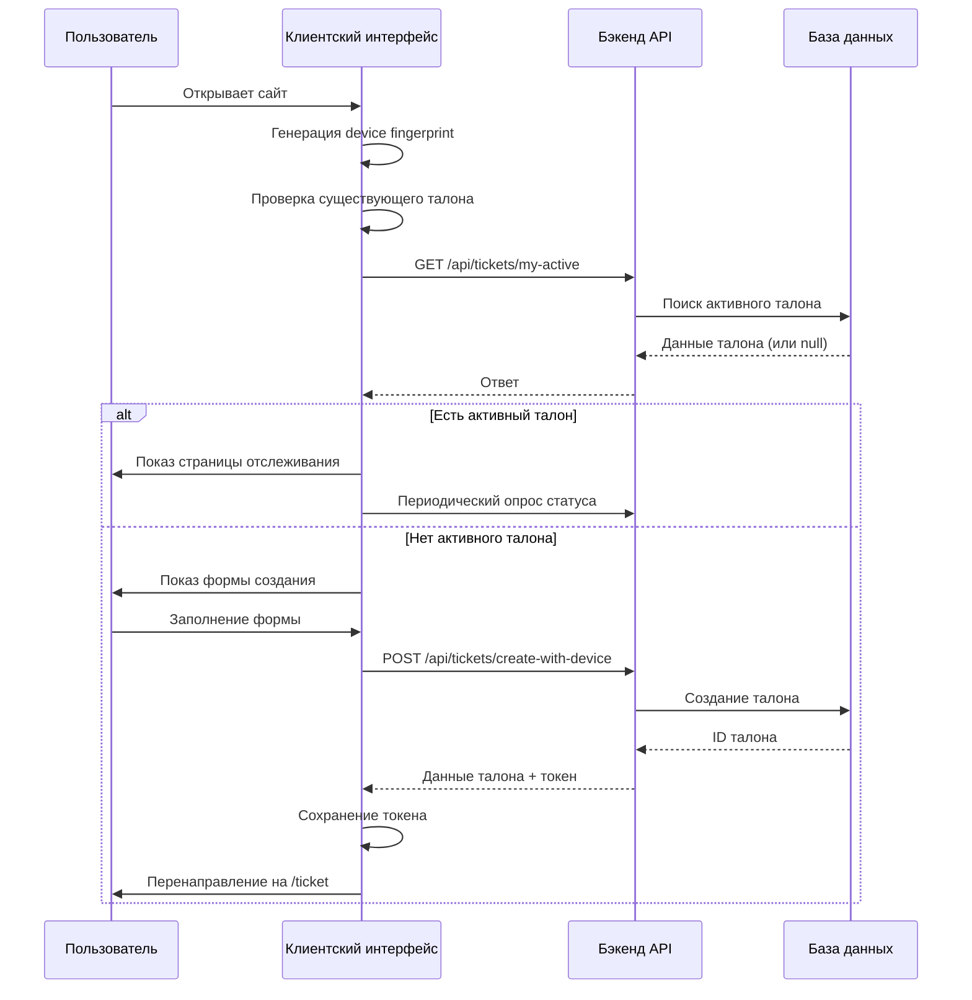

# Документация фронтенда системы управления виртуальной очередью

## Часть 2: Клиентский интерфейс (client-interface)

### Обзор
Клиентский интерфейс предназначен для пользователей, которые хотят встать в очередь и отслеживать статус своего талона. Это одностраничное приложение (SPA) с двумя основными страницами: главная (форма создания талона) и страница отслеживания талона.

### Технологический стек

| Компонент | Версия | Назначение |
|-----------|--------|------------|
| Vue 3 | ^3.5.34 | Фреймворк для построения UI |
| TypeScript | ^6.0.3 | Типизация кода |
| Pinia | ^3.0.4 | Управление состоянием |
| Vue Router | ^4.6.4 | Маршрутизация |
| Axios | ^1.16.1 | HTTP-клиент |
| Bootstrap 5 | ^5.3.8 | CSS-фреймворк |
| @popperjs/core | ^2.11.8 | Всплывающие подсказки |
| @fingerprintjs/fingerprintjs | ^5.2.0 | Генерация device fingerprint |
| Vite | ^8.0.12 | Сборка и dev-сервер |

### Структура проекта

```text
src/
├── App.vue                    # Корневой компонент с навигацией
├── main.js                    # Точка входа
├── env.d.ts                   # Объявления типов для env переменных
├── style.css                  # Глобальные стили
├── assets/                    # Статические ресурсы
├── components/                # Переиспользуемые компоненты
│   ├── TicketForm.vue         # Форма создания талона
│   ├── TicketStatusCard.vue   # Карточка статуса талона
│   └── TicketActions.vue      # Действия с талоном (отмена, перемещение)
├── composables/               # Композаблы (логика)
│   ├── useApi.ts             # Обёртка над Axios с интерцепторами
│   ├── useAuth.ts            # Логика аутентификации по device fingerprint
│   └── useTicket.ts          # Операции с талонами (создание, обновление)
├── stores/                    # Хранилища Pinia
│   ├── auth.store.ts         # Состояние аутентификации
│   ├── ticket.store.ts       # Состояние текущего талона
│   └── index.ts              # Экспорт всех stores
├── types/                     # TypeScript-типы
│   └── api.ts                # Интерфейсы DTO
├── views/                     # Страницы
│   ├── HomeView.vue          # Главная страница с формой
│   ├── TicketView.vue        # Страница отслеживания талона
│   └── NotFound.vue          # 404 страница
└── router/                    # Маршрутизация
    └── index.ts              # Конфигурация роутера
```

### Ключевые компоненты

#### 1. App.vue
Корневой компонент, содержащий:
- Навигационную панель с логотипом и кнопкой выхода
- Глобальные уведомления об ошибках и успехах
- `<RouterView>` для отображения страниц
- Логику выхода из системы

#### 2. TicketForm.vue
Форма создания нового талона с полями:
- Имя (обязательное)
- Фамилия (обязательное)
- Тип обслуживания (опциональный выпадающий список)
- Кнопка "Встать в очередь"

**Особенности:**
- Валидация полей
- Загрузка списка типов обслуживания с бэкенда
- Генерация device fingerprint при первом посещении
- Обработка ошибок и успешного создания

#### 3. TicketStatusCard.vue
Компонент отображения текущего статуса талона:
- Номер талона
- Позиция в очереди
- Примерное время ожидания
- Статус (ожидание, вызван, обслуживается, завершён)
- Прогресс-бар ожидания

#### 4. TicketActions.vue
Кнопки действий для активного талона:
- "Отменить талон" - отправка запроса на отмену
- "Переместить назад на N позиций" - выбор количества шагов
- "Обновить статус" - ручное обновление данных

### Управление состоянием (Pinia Stores)

#### Auth Store (`auth.store.ts`)
Управляет аутентификацией на основе device fingerprint и токена сессии.

```typescript
export const useAuthStore = defineStore('auth', () => {
  const token = ref<string | null>(localStorage.getItem('sessionToken'));
  const deviceFingerprint = ref<string | null>(localStorage.getItem('deviceFingerprint'));
  
  const isAuthenticated = computed(() => !!token.value);
  
  function setToken(newToken: string) { ... }
  function clearToken() { ... }
  function setDeviceFingerprint(fingerprint: string) { ... }
  function clearDeviceFingerprint() { ... }
  
  return { token, deviceFingerprint, isAuthenticated, setToken, clearToken, ... };
});
```

#### Ticket Store (`ticket.store.ts`)
Хранит данные о текущем активном талоне пользователя.

```typescript
export const useTicketStore = defineStore('ticket', () => {
  const activeTicket = ref<MyActiveTicketDetailDto | null>(null);
  const loading = ref(false);
  const error = ref<string | null>(null);
  
  function setActiveTicket(ticket: MyActiveTicketDetailDto | null) { ... }
  function setLoading(isLoading: boolean) { ... }
  function setError(err: string | null) { ... }
  function clear() { ... }
  
  return { activeTicket, loading, error, setActiveTicket, ... };
});
```

### Композаблы (Composables)

#### useApi.ts
Создаёт настроенный экземпляр Axios с:
- Базовым URL из переменной окружения `VITE_API_BASE_URL`
- Автоматическим добавлением токена авторизации в заголовки
- Интерцептором для обработки ошибок 401 (автоматический выход)
- Состоянием загрузки и ошибок

```typescript
export function useApi() {
  const authStore = useAuthStore();
  const loading = ref(false);
  const error = ref<string | null>(null);
  
  const apiClient: AxiosInstance = axios.create({ ... });
  
  // Интерцептор для добавления токена
  apiClient.interceptors.request.use((config) => {
    if (authStore.token) {
      config.headers.Authorization = `Bearer ${authStore.token}`;
    }
    return config;
  });
  
  // ... остальная реализация
}
```

#### useAuth.ts
Содержит логику работы с device fingerprint:
- Генерация уникального отпечатка устройства с помощью библиотеки `@fingerprintjs/fingerprintjs`
- Сохранение в localStorage
- Использование для аутентификации при создании талона

#### useTicket.ts
Предоставляет методы для работы с талонами:
- `createTicket()` - создание нового талона
- `fetchMyActiveTicket()` - получение активного талона пользователя
- `cancelTicket()` - отмена талона
- `moveTicketBackward()` - перемещение талона назад в очереди
- `pollTicketStatus()` - периодический опрос статуса талона

### Маршрутизация (Router)

Конфигурация роутера находится в `src/router/index.ts`:

```typescript
const routes = [
  {
    path: '/',
    name: 'Home',
    component: HomeView,
  },
  {
    path: '/ticket',
    name: 'Ticket',
    component: TicketView,
    meta: { requiresAuth: true },
  },
  {
    path: '/:pathMatch(.*)*',
    name: 'NotFound',
    component: NotFound,
  },
];
```

**Навигационные хуки:**
- Если пользователь не авторизован и пытается перейти на `/ticket` - перенаправление на `/`
- Если пользователь авторизован и пытается перейти на `/` - перенаправление на `/ticket`

### Типы данных (TypeScript)

Файл `src/types/api.ts` содержит интерфейсы, соответствующие DTO бэкенда:

```typescript
export interface TicketDto {
  id: number;
  queueSessionId: number;
  ticketNumber: string;
  clientName: string;
  clientSurname: string;
  serviceTypeId?: number;
  serviceTypeName?: string;
  serviceLetter?: string;
  sortOrder: number;
  priorityLevel: number;
  status: string;
  version: number;
  createdAt: string;
  calledAt?: string;
  serviceStartedAt?: string;
  serviceEndedAt?: string;
  servedByUserId?: number;
  servedByUserName?: string;
  cancelReason?: string;
  positionInQueue: number;
}

export interface MyActiveTicketDetailDto extends TicketDto {
  estimatedWaitMinutes?: number;
  totalWaiting: number;
}
```

### Конфигурация сборки (Vite)

Файл `vite.config.js` настраивает:
- Порт разработки: 5173
- Проксирование запросов `/api` на бэкенд (http://localhost:8080)
- Плагин Vue для обработки `.vue` файлов

```javascript
export default defineConfig({
  plugins: [vue()],
  server: {
    port: 5173,
    proxy: {
      '/api': {
        target: 'http://localhost:8080',
        changeOrigin: true,
        secure: false
      }
    }
  }
});
```

### Рабочий процесс пользователя



### Особенности реализации

1. **Device Fingerprint** - используется для идентификации устройства без необходимости регистрации пользователя.
2. **Автоматический опрос статуса** - при наличии активного талона интерфейс каждые 10 секунд запрашивает обновления.
3. **Адаптивный дизайн** - Bootstrap 5 обеспечивает корректное отображение на мобильных устройствах.
4. **Локализация ошибок** - все ошибки отображаются на русском языке.
5. **Прогрессивное улучшение** - базовый функционал работает даже при отключённом JavaScript.

### Следующие шаги развития

1. Добавление PUSH-уведомлений через WebSocket для мгновенного обновления статуса.
2. Поддержка нескольких языков интерфейса.
3. Интеграция с системой SMS-уведомлений.
4. Расширенная аналитика времени ожидания.

---