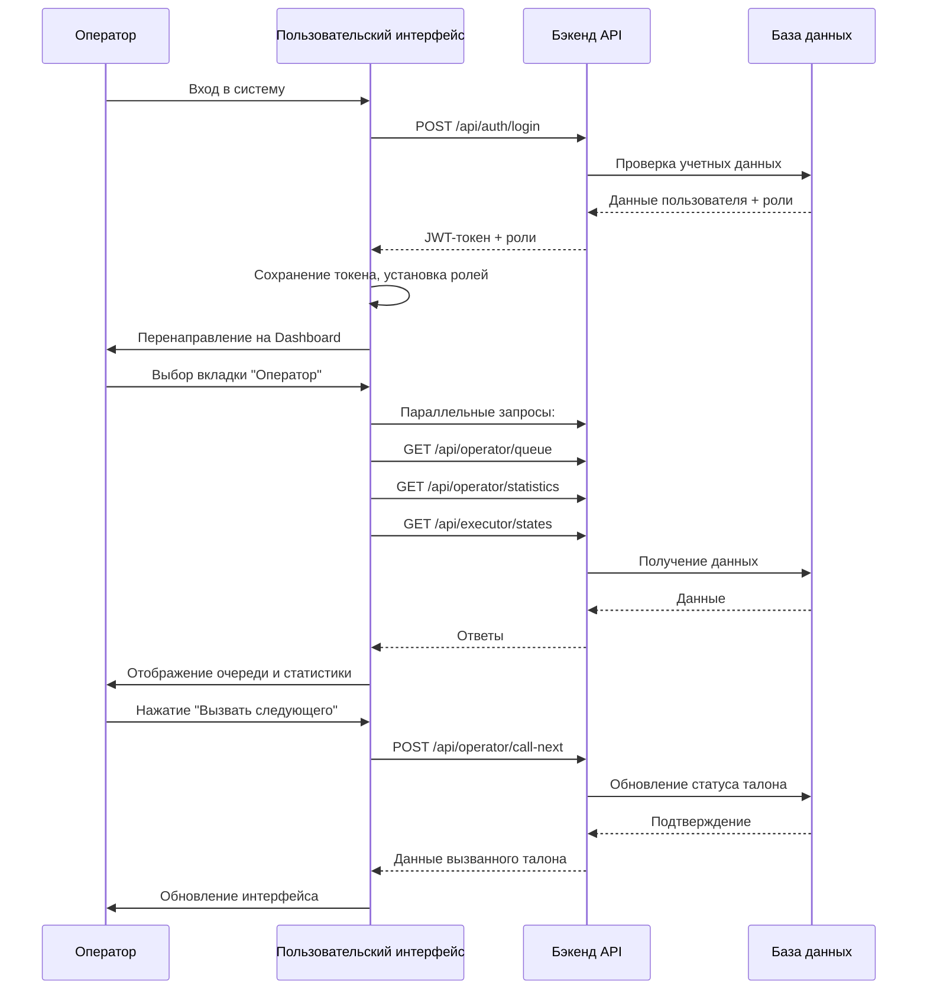

# Документация фронтенда системы управления виртуальной очередью

## Часть 3: Пользовательский интерфейс (user-interface)

### Обзор
Пользовательский интерфейс предназначен для персонала системы управления очередью: операторов, исполнителей и администраторов. Это многомодульное SPA-приложение с ролевым доступом, где каждый тип пользователя видит соответствующий его роли функционал.

### Технологический стек

| Компонент | Версия | Назначение |
|-----------|--------|------------|
| Vue 3 | ^3.5.34 | Фреймворк для построения UI |
| Vue Router | ^4.3.0 | Маршрутизация |
| Pinia | ^2.1.7 | Управление состоянием |
| Axios | ^1.6.0 | HTTP-клиент |
| Bootstrap 5 | ^5.3.0 | CSS-фреймворк |
| @popperjs/core | ^2.11.8 | Всплывающие подсказки |
| Bootstrap Icons | ^1.11.3 | Иконки |
| Vite | ^8.0.12 | Сборка и dev-сервер |

**Отличие от клиентского интерфейса:** используется JavaScript вместо TypeScript, более старая версия Pinia (2.x), добавлены Bootstrap Icons.

### Структура проекта

```
src/
├── App.vue                    # Корневой компонент
├── main.js                    # Точка входа
├── style.css                  # Глобальные стили
├── assets/                    # Статические ресурсы
├── api/                       # API-клиенты
│   ├── index.js              # Базовый конфиг Axios
│   ├── auth.js               # Аутентификация
│   ├── operator.js           # API оператора
│   ├── executor.js           # API исполнителя
│   └── admin.js              # API администратора
├── components/                # Переиспользуемые компоненты
│   └── HelloWorld.vue        # Пример компонента
├── stores/                    # Хранилища Pinia
│   ├── auth.js               # Состояние аутентификации и пользователя
│   ├── operator.js           # Состояние оператора (очередь, статистика)
│   ├── executor.js           # Состояние исполнителя
│   └── admin.js              # Состояние администратора
├── views/                     # Страницы
│   ├── Login.vue             # Страница входа
│   ├── Dashboard.vue         # Главная панель с вкладками
│   ├── OperatorView.vue      # Интерфейс оператора
│   ├── ExecutorView.vue      # Интерфейс исполнителя
│   └── AdminView.vue         # Интерфейс администратора
└── router/                    # Маршрутизация
    └── index.js              # Конфигурация роутера
```

### Ролевая модель

Система поддерживает три основные роли:

1. **Оператор (Operator)** - управление очередью:
   - Просмотр списка ожидающих
   - Вызов следующего клиента
   - Перемещение клиентов в очереди
   - Отмена талонов
   - Просмотр статистики

2. **Исполнитель (Executor)** - обслуживание клиентов:
   - Подтверждение готовности к обслуживанию
   - Начало и завершение обслуживания
   - Просмотр списка вызванных клиентов
   - Статистика по обслуживанию

3. **Администратор (Admin)** - управление системой:
   - Управление пользователями
   - Настройка типов обслуживания
   - Конфигурация сессий очереди
   - Просмотр логов событий

### Ключевые компоненты

#### 1. Dashboard.vue
Главный компонент после входа, реализующий вкладки по ролям.

**Особенности:**
- Динамическое отображение вкладок в зависимости от ролей пользователя
- Навигационная панель с информацией о пользователе и кнопкой выхода
- Переключение между вкладками "Исполнитель", "Оператор", "Администратор"
- Централизованное управление состоянием через stores

#### 2. OperatorView.vue
Интерфейс оператора с двумя основными секциями:
- **Список ожидающих** - таблица талонов в порядке очереди
- **Список вызванных** - талоны, которые были вызваны исполнителями

**Функционал:**
- Drag-and-drop для перемещения талонов в очереди
- Кнопки "Вызвать", "Отменить", "Пропустить" для каждого талона
- Кнопка "Вызвать следующего" для массового вызова
- Статистика в реальном времени
- Фильтрация по типу обслуживания

#### 3. ExecutorView.vue
Интерфейс исполнителя с фокусом на обслуживании:

```vue
<template>
  <div class="executor-view">
    <div class="card">
      <div class="card-header">
        <h5>Текущий статус</h5>
      </div>
      <div class="card-body">
        <div v-if="currentTicket">
          <!-- Отображение текущего обслуживаемого клиента -->
        </div>
        <div v-else>
          <button @click="callNext" :disabled="!hasReadyExecutor">
            Вызвать следующего
          </button>
        </div>
      </div>
    </div>
    <!-- Список вызванных клиентов -->
  </div>
</template>
```

#### 4. AdminView.vue
Интерфейс администратора (в разработке, содержит заглушку).

#### 5. Login.vue
Страница входа с формой:
- Поле логина
- Поле пароля
- Обработка ошибок аутентификации
- Перенаправление на Dashboard после успешного входа

### Управление состоянием (Pinia Stores)

#### Auth Store (`stores/auth.js`)
Самый сложный store, управляющий аутентификацией и ролями.

```javascript
export const useAuthStore = defineStore('auth', () => {
  const token = ref(localStorage.getItem('token') || null);
  const user = ref(null);
  const roles = ref([]);
  
  const isAuthenticated = computed(() => !!token.value);
  const hasRole = (role) => roles.value.includes(role);
  const hasAnyRole = (roleList) => roleList.some(r => roles.value.includes(r));
  
  // Проверки для конкретных ролей
  const hasOperatorRole = computed(() => hasRole('Operator'));
  const hasExecutorRole = computed(() => hasRole('Executor'));
  const hasAdminRole = computed(() => hasRole('Admin'));
  
  async function loginUser(credentials) { ... }
  async function logoutUser() { ... }
  async function fetchCurrentUser() { ... }
  
  return { token, user, roles, isAuthenticated, hasRole, hasAnyRole, ... };
});
```

#### Operator Store (`stores/operator.js`)
Управляет состоянием оператора: очередью, статистикой, исполнителями.

**Ключевые данные:**
- `queue` - список талонов в очереди
- `allTickets` - все талоны (для статистики)
- `executorStates` - статусы исполнителей
- `statistics` - статистика очереди
- `loading`, `error` - состояние загрузки

**Методы:**
- `fetchQueue()` - загрузка очереди
- `fetchAllTickets()` - загрузка всех талонов
- `fetchExecutorStates()` - загрузка статусов исполнителей
- `callTicket(ticketId)` - вызов талона
- `cancelTicket(ticketId)` - отмена талона
- `moveTicket(ticketId, newPosition)` - перемещение талона
- `skipTicket(ticketId)` - пропуск талона

#### Executor Store (`stores/executor.js`)
Управляет состоянием исполнителя:
- `currentTicket` - текущий обслуживаемый талон
- `calledTickets` - список вызванных талонов
- `isReady` - готовность к обслуживанию

**Методы:**
- `fetchCurrentTicket()` - загрузка текущего талона
- `callNext()` - вызов следующего клиента
- `startService()` - начало обслуживания
- `completeService()` - завершение обслуживания
- `setReadyState(isReady)` - установка статуса готовности

#### Admin Store (`stores/admin.js`)
Заглушка для будущей реализации административных функций.

### API-клиенты

Структура API-клиентов следует принципу разделения по доменам:

#### Базовый клиент (`api/index.js`)
Создаёт экземпляр Axios с базовой конфигурацией:

```javascript
import axios from 'axios';

const apiClient = axios.create({
  baseURL: import.meta.env.VITE_API_BASE_URL || 'http://localhost:8080',
  headers: {
    'Content-Type': 'application/json',
  },
});

// Интерцептор для добавления токена
apiClient.interceptors.request.use((config) => {
  const token = localStorage.getItem('token');
  if (token) {
    config.headers.Authorization = `Bearer ${token}`;
  }
  return config;
});

export default apiClient;
```

#### Специализированные клиенты:
- `auth.js` - `/api/auth/*` (вход, выход, обновление токена)
- `operator.js` - `/api/operator/*` (управление очередью)
- `executor.js` - `/api/executor/*` (управление обслуживанием)
- `admin.js` - `/api/admin/*` (административные функции)

### Маршрутизация

Конфигурация роутера в `src/router/index.js`:

```javascript
const routes = [
  {
    path: '/login',
    name: 'Login',
    component: () => import('@/views/Login.vue'),
    meta: { requiresGuest: true }
  },
  {
    path: '/dashboard',
    name: 'Dashboard',
    component: () => import('@/views/Dashboard.vue'),
    meta: { requiresAuth: true }
  },
  {
    path: '/',
    redirect: '/dashboard'
  },
  {
    path: '/:pathMatch(.*)*',
    redirect: '/dashboard'
  }
];
```

**Навигационные хуки:**
- Если маршрут требует авторизации (`requiresAuth`) и пользователь не авторизован - перенаправление на `/login`
- Если маршрут требует гостевого статуса (`requiresGuest`) и пользователь авторизован - перенаправление на `/dashboard`

### Конфигурация сборки (Vite)

Файл `vite.config.js` настраивает:
- Порт разработки: 5174 (отличается от клиентского интерфейса)
- Проксирование запросов `/api` на бэкенд
- Алиас `@` для удобного импорта из `src`

```javascript
export default defineConfig({
  plugins: [vue()],
  resolve: {
    alias: {
      '@': path.resolve(__dirname, './src')
    }
  },
  server: {
    port: 5174,
    proxy: {
      '/api': {
        target: 'http://localhost:8080',
        changeOrigin: true,
        secure: false
      }
    }
  }
});
```

### Рабочий процесс оператора



### Особенности реализации

1. **Динамические вкладки** - интерфейс адаптируется под роли пользователя, показывая только релевантные вкладки.
2. **Drag-and-drop** - реализовано с помощью нативного HTML5 Drag API для перемещения талонов в очереди.
3. **Реальное время** - периодический опрос данных (каждые 5-10 секунд) для актуальности информации.
4. **Обработка конкурентности** - оптимистичные обновления UI с последующей синхронизацией с сервером.
5. **Адаптивный дизайн** - Bootstrap 5 Grid обеспечивает корректное отображение на разных устройствах.

### Интеграция с бэкендом

Пользовательский интерфейс тесно интегрирован с .NET бэкендом через REST API:

| Модуль | Конечные точки | Назначение |
|--------|----------------|------------|
| Аутентификация | `/api/auth/login`, `/api/auth/logout` | Вход/выход из системы |
| Оператор | `/api/operator/queue`, `/api/operator/call-next` | Управление очередью |
| Исполнитель | `/api/executor/current`, `/api/executor/call-next` | Управление обслуживанием |
| Пользователи | `/api/users/me` | Получение информации о текущем пользователе |

### Следующие шаги развития

1. **WebSocket интеграция** - замена периодического опроса на реальное время через SignalR.
2. **Расширенная аналитика** - графики и отчёты по эффективности работы очереди.
3. **Мобильное приложение** - PWA-версия для планшетов операторов.
4. **Офлайн-режим** - кэширование данных для работы при временной потере соединения.
5. **Расширенное администрирование** - полный CRUD для всех сущностей системы.

---