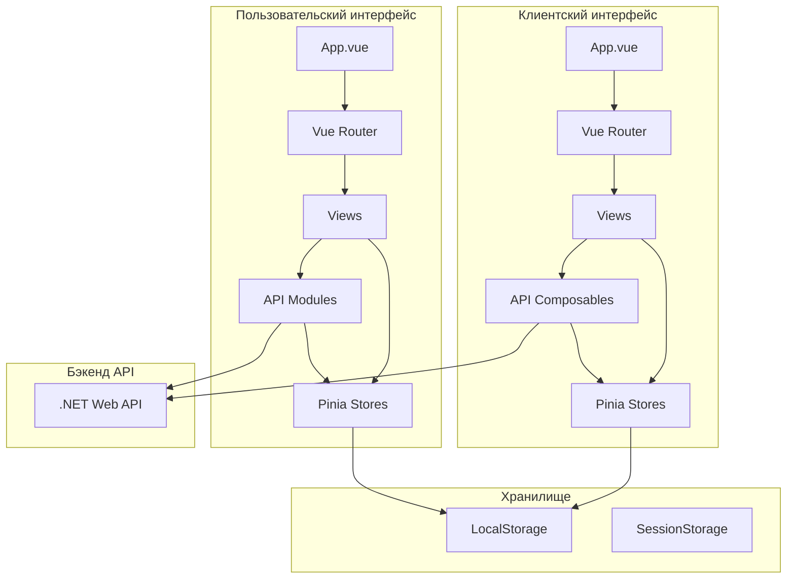
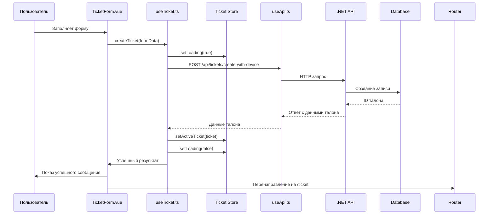

# Документация фронтенда системы управления виртуальной очередью

## Часть 4: Общие подходы и интеграция с API

### Введение
В этой части рассматриваются общие архитектурные подходы, используемые в обоих фронтенд-приложениях, а также детали интеграции с бэкенд-API. Эти подходы обеспечивают согласованность, поддерживаемость и масштабируемость системы.

### 1. Управление состоянием (State Management)

#### Подход Pinia Stores
Оба приложения используют Pinia в качестве централизованного хранилища состояния. Pinia была выбрана как официальное решение для Vue 3, преемник Vuex.

**Преимущества выбора Pinia:**
- TypeScript поддержка из коробки  
- Модульная архитектура  
- DevTools интеграция  
- Простой API с Composition API стилем  

#### Паттерны использования Stores

##### Реактивные вычисления (Computed Properties)
```typescript
// В клиентском интерфейсе
const isAuthenticated = computed(() => !!token.value);

// В пользовательском интерфейсе  
const hasOperatorRole = computed(() => hasRole('Operator'));
```

##### Асинхронные действия (Actions)
```typescript
async function fetchQueue() {
  loading.value = true;
  try {
    const data = await api.getQueue();
    queue.value = data;
  } catch (err) {
    error.value = err.response?.data?.error || 'Ошибка загрузки';
  } finally {
    loading.value = false;
  }
}
```

##### Сохранение состояния между сессиями
```typescript
// Сохранение токена в localStorage
function setToken(newToken: string) {
  token.value = newToken;
  localStorage.setItem('sessionToken', newToken);
}

// Восстановление при инициализации
const token = ref<string | null>(localStorage.getItem('sessionToken'));
```

### 2. Маршрутизация и навигация

#### Защищённые маршруты
Оба приложения реализуют защиту маршрутов через навигационные хуки:

**Клиентский интерфейс:**
```typescript
router.beforeEach((to, from, next) => {
  const authStore = useAuthStore();
  
  if (to.meta.requiresAuth && !authStore.isAuthenticated) {
    next('/');
    return;
  }
  
  if (to.path === '/' && authStore.isAuthenticated) {
    next('/ticket');
    return;
  }
  
  next();
});
```

**Пользовательский интерфейс:**
```javascript
router.beforeEach((to, from, next) => {
  const authStore = useAuthStore()

  if (to.meta.requiresAuth && !authStore.isAuthenticated) {
    next('/login')
  } else if (to.meta.requiresGuest && authStore.isAuthenticated) {
    next('/dashboard')
  } else {
    next()
  }
})
```

#### Ленивая загрузка компонентов
Пользовательский интерфейс использует динамические импорты для code splitting:

```javascript
component: () => import('@/views/Login.vue')
```

### 3. Работа с API

#### Единый подход к HTTP-клиенту
Оба приложения используют Axios с похожей конфигурацией:

**Базовые настройки:**
```javascript
const apiClient = axios.create({
  baseURL: import.meta.env.VITE_API_BASE_URL || 'http://localhost:8080',
  headers: {
    'Content-Type': 'application/json',
  },
});
```

#### Интерцепторы запросов

##### Добавление токена авторизации
```typescript
apiClient.interceptors.request.use((config) => {
  if (authStore.token) {
    config.headers.Authorization = `Bearer ${authStore.token}`;
  }
  return config;
});
```

##### Обработка ошибок
```typescript
apiClient.interceptors.response.use(
  (response) => response,
  (err) => {
    if (err.response?.status === 401) {
      authStore.clearToken();
      window.location.href = '/';
    }
    return Promise.reject(err);
  }
);
```

#### Паттерны работы с API

##### Композабл useApi (клиентский интерфейс)
```typescript
export function useApi() {
  const loading = ref(false);
  const error = ref<string | null>(null);
  
  async function request<T = any>(config: AxiosRequestConfig): Promise<T> {
    loading.value = true;
    error.value = null;
    try {
      const response: AxiosResponse<T> = await apiClient.request(config);
      return response.data;
    } catch (err: any) {
      error.value = err.response?.data?.message || err.message || 'Ошибка сети';
      throw err;
    } finally {
      loading.value = false;
    }
  }
  
  return { loading, error, request };
}
```

##### Специализированные API-модули (пользовательский интерфейс)
```javascript
// api/operator.js
export const operatorApi = {
  getQueue() {
    return apiClient.get('/api/operator/queue')
      .then(response => response.data)
  },
  callNext() {
    return apiClient.post('/api/operator/call-next')
      .then(response => response.data)
  },
  // ... другие методы
}
```

### 4. Аутентификация и авторизация

#### Два разных подхода

##### Клиентский интерфейс: Device Fingerprint
- Использует библиотеку `@fingerprintjs/fingerprintjs` для генерации уникального идентификатора устройства
- Не требует пароля или логина от пользователя
- Токен сессии привязывается к device fingerprint
- Подходит для анонимных клиентов

```typescript
// Генерация fingerprint
import FingerprintJS from '@fingerprintjs/fingerprintjs';

const fpPromise = FingerprintJS.load();
const fp = await fpPromise;
const result = await fp.get();
const fingerprint = result.visitorId;
```

##### Пользовательский интерфейс: JWT + Роли
- Традиционная аутентификация по логину/паролю
- JWT-токен с claims о ролях пользователя
- Ролевая модель (Operator, Executor, Admin)
- Токен сохраняется в localStorage

```javascript
async function loginUser(credentials) {
  const response = await login(credentials);
  token.value = response.Token || response.token;
  // Извлечение ролей из ответа
  const extractedRoles = response.RoleCodes || response.roleCodes || [];
  roles.value = extractedRoles.map(r => typeof r === 'string' ? r : r?.Code);
  localStorage.setItem('token', token.value);
}
```

### 5. Обработка ошибок и уведомления

#### Единый подход к ошибкам
- Все ошибки API преобразуются в человекочитаемые сообщения
- Глобальные уведомления через ref-переменные в App.vue
- Автоматическое скрытие уведомлений через setTimeout

```vue
<!-- В App.vue клиентского интерфейса -->
<div v-if="globalError" class="alert alert-danger alert-dismissible fade show">
  {{ globalError }}
</div>
<div v-if="globalSuccess" class="alert alert-success alert-dismissible fade show">
  {{ globalSuccess }}
</div>
```

#### Состояние загрузки
- Единый паттерн `loading` ref в stores и composables
- Отключение кнопок и полей ввода во время загрузки
- Индикаторы загрузки через CSS или спиннеры Bootstrap

```vue
<button :disabled="loading" @click="handleSubmit">
  <span v-if="loading" class="spinner-border spinner-border-sm"></span>
  {{ loading ? 'Загрузка...' : 'Встать в очередь' }}
</button>
```

### 6. Стилизация и UI-компоненты

#### Bootstrap 5 как основа
Оба приложения используют Bootstrap 5 для:
- Адаптивной сетки (grid system)  
- Готовых компонентов (карточки, кнопки, формы)  
- Утилитарных классов (margin, padding, colors)  
- Модальных окон и всплывающих подсказок  

#### Дополнительные библиотеки
- **@popperjs/core** - позиционирование всплывающих элементов
- **Bootstrap Icons** (только пользовательский интерфейс) - векторные иконки
- Нативные CSS-переменные для кастомизации

#### Кастомизация стилей
```css
/* В style.css клиентского интерфейса */
:root {
  --primary-color: #0d6efd;
  --secondary-color: #6c757d;
}

.app {
  min-height: 100vh;
  background-color: #f8f9fa;
}
```

### 7. Конфигурация окружения

#### Переменные окружения Vite
Оба проекта используют Vite, который поддерживает `.env` файлы:

```env
VITE_API_BASE_URL=http://localhost:8080
VITE_APP_NAME=Virtual Queue System
```

Доступ через `import.meta.env.VITE_API_BASE_URL`.

#### Проксирование в development
Vite dev server проксирует запросы к бэкенду для избежания CORS:

```javascript
server: {
  proxy: {
    '/api': {
      target: 'http://localhost:8080',
      changeOrigin: true,
      secure: false
    }
  }
}
```

### 8. Оптимизация производительности

#### Ленивая загрузка (Code Splitting)
- Динамические импорты для маршрутов (пользовательский интерфейс)
- Разделение кода по маршрутам уменьшает начальный размер бандла

#### Мемоизация вычислений
- Использование `computed()` для производных данных
- Кэширование результатов дорогостоящих вычислений

#### Оптимистичные обновления UI
- Немедленное обновление UI при действиях пользователя
- Откат при ошибке от сервера
- Улучшает воспринимаемую производительность

```typescript
async function callTicket(ticketId: number) {
  // Оптимистичное обновление
  const oldQueue = [...queue.value];
  queue.value = queue.value.filter(t => t.id !== ticketId);
  
  try {
    await api.callTicket(ticketId);
  } catch (err) {
    // Откат при ошибке
    queue.value = oldQueue;
    showGlobalError('Не удалось вызвать талон');
  }
}
```

### 9. Тестирование и отладка

#### DevTools интеграция
- Vue DevTools для отладки компонентов и состояния
- Pinia DevTools для мониторинга stores
- Browser DevTools для сетевых запросов

#### Логирование
Консистентное логирование в пользовательском интерфейсе:

```javascript
console.log('[AuthStore] Login response:', response);
console.log('[AuthStore] Login response keys:', Object.keys(response));
console.error('[AuthStore] Login error:', error);
```

#### TypeScript как инструмент предотвращения ошибок
Клиентский интерфейс использует TypeScript для:
- Проверки типов на этапе компиляции  
- Автодополнения в IDE  
- Самодокументирующегося кода через интерфейсы  

### 10. Архитектурные диаграммы

#### Полная архитектура фронтенда



#### Поток данных при создании талона



### 11. Рекомендации по развитию

#### Технический долг
1. **Единая кодовая база TypeScript** - миграция пользовательского интерфейса с JavaScript на TypeScript
2. **Общие утилиты** - выделение общих функций (обработка ошибок, форматирование) в отдельный пакет
3. **Интернационализация** - добавление поддержки i18n для мультиязычности

#### Масштабирование
1. **Микросервисная архитектура фронтенда** - разделение на независимые модули (аутентификация, очередь, администрирование)
2. **SSR/SSG** - рассмотреть Next.js/Nuxt.js для SEO и производительности
3. **PWA** - превращение в прогрессивное веб-приложение с офлайн-режимом

#### Безопасность
1. **HTTPS enforcement** - принудительное использование HTTPS в production
2. **Content Security Policy** - настройка CSP заголовков
3. **Rate limiting на клиенте** - предотвращение спама API-запросами

### Заключение
Фронтенд система управления виртуальной очередью демонстрирует современные подходы к разработке веб-приложений на Vue 3. Разделение на два независимых приложения с разными подходами к аутентификации позволяет оптимально решать задачи разных категорий пользователей. Использование Pinia, Composition API и TypeScript обеспечивает поддерживаемость и масштабируемость кодовой базы.

---