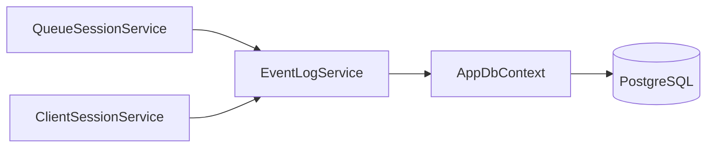
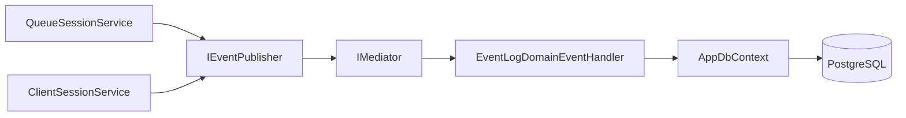

# План: Асинхронное логирование через MediatR Domain Events

## 1. Цель

Заменить синхронное логирование (`EventLogService.LogAsync()`) на асинхронное на основе MediatR Domain Events. Сервисы будут публиковать события во внутреннюю шину событий, а `EventLogDomainEventHandler` будет записывать их в базу данных.

## 2. Архитектурные изменения

### 2.1. Текущая архитектура (синхронная)



Проблемы:
- Сервисы напрямую зависят от `EventLogService`
- Логирование происходит синхронно в рамках транзакции
- Тightly coupled архитектура

### 2.2. Новая архитектура (асинхронная)



### 2.3. Диаграмма последовательности

```mermaid
sequenceDiagram
    participant Q as QueueSessionService
    pub as IEventPublisher
    med as IMediator
    handler as EventLogDomainEventHandler
    db as AppDbContext

    Q->>pub: Publish(new QueueSessionCreatedEvent)
    pub->>med: Publish(event)
    med->>handler: Handle(event)
    handler->>db: Add(eventLog)
    db->>db: SaveChangesAsync()
```

## 3. Детальный план реализации

### Шаг 1: Создание Domain Events

**Файл:** `backend/src/Application/Events/DomainEvent.cs`

```csharp
namespace Application.Events;

/// <summary>
/// Базовый класс для всех доменных событий
/// </summary>
public abstract class DomainEvent : INotification
{
    public DateTime OccurredAt { get; } = DateTime.UtcNow;
}
```

**Файл:** `backend/src/Application/Events/QueueSessionEvents.cs`

```csharp
namespace Application.Events;

public sealed class QueueSessionCreatedEvent : DomainEvent
{
    public int SessionId { get; }
    public int QueueConfigId { get; }
    public int CreatedById { get; }
}

public sealed class QueueSessionStatusChangedEvent : DomainEvent
{
    public int SessionId { get; }
    public SessionStatus NewStatus { get; }
    public SessionStatus? OldStatus { get; }
    public int ActorUserId { get; }
}
```

**Файл:** `backend/src/Application/Events/TicketEvents.cs`

```csharp
namespace Application.Events;

public sealed class TicketCreatedEvent : DomainEvent
{
    public int TicketId { get; }
    public int SessionId { get; }
    public int ClientSessionId { get; }
}

public sealed class TicketStatusChangedEvent : DomainEvent
{
    public int TicketId { get; }
    public TicketStatus NewStatus { get; }
    public TicketStatus? OldStatus { get; }
    public int ActorUserId { get; }
}
```

**Файл:** `backend/src/Application/Events/ClientSessionEvents.cs`

```csharp
namespace Application.Events;

public sealed class ClientSessionInvalidatedEvent : DomainEvent
{
    public int ClientSessionId { get; }
    public int ActorUserId { get; }
}
```

### Шаг 2: Создание IEventPublisher

**Файл:** `backend/src/Application/Events/IEventPublisher.cs`

```csharp
namespace Application.Events;

/// <summary>
/// Интерфейс для публикации доменных событий
/// </summary>
public interface IEventPublisher
{
    Task PublishAsync<TDomainEvent>(TDomainEvent domainEvent) where TDomainEvent : class, INotification;
}
```

**Файл:** `backend/src/Application/Events/MediatREventPublisher.cs`

```csharp
namespace Application.Events;

public class MediatREventPublisher : IEventPublisher
{
    private readonly IMediator _mediator;

    public MediatREventPublisher(IMediator mediator)
    {
        _mediator = mediator;
    }

    public async Task PublishAsync<TDomainEvent>(TDomainEvent domainEvent) where TDomainEvent : class, INotification
    {
        await _mediator.Publish(domainEvent);
    }
}
```

### Шаг 3: Создание EventLogDomainEventHandler

**Файл:** `backend/src/Application/Events/EventLogDomainEventHandler.cs`

```csharp
namespace Application.Events;

/// <summary>
/// Обработчик всех доменных событий для логирования
/// </summary>
public class EventLogDomainEventHandler :
    INotificationHandler<QueueSessionCreatedEvent>,
    INotificationHandler<QueueSessionStatusChangedEvent>,
    INotificationHandler<TicketCreatedEvent>,
    INotificationHandler<TicketStatusChangedEvent>,
    INotificationHandler<ClientSessionInvalidatedEvent>
{
    private readonly AppDbContext _context;

    public EventLogDomainEventHandler(AppDbContext context)
    {
        _context = context;
    }

    public async Task Handle(QueueSessionCreatedEvent notification, CancellationToken cancellationToken)
    {
        var eventLog = new EventLog
        {
            QueueSessionId = notification.SessionId,
            TicketId = null,
            ActorUserId = notification.CreatedById,
            EventType = EventType.QueueSessionCreated,
            Timestamp = notification.OccurredAt,
            Details = JsonSerializer.Serialize(new { notification.SessionId, notification.QueueConfigId, notification.CreatedById })
        };

        _context.EventLogs.Add(eventLog);
        await _context.SaveChangesAsync(cancellationToken);
    }

    public async Task Handle(QueueSessionStatusChangedEvent notification, CancellationToken cancellationToken)
    {
        var eventLog = new EventLog
        {
            QueueSessionId = notification.SessionId,
            TicketId = null,
            ActorUserId = notification.ActorUserId,
            EventType = EventType.QueueSessionStatusChanged,
            Timestamp = notification.OccurredAt,
            Details = JsonSerializer.Serialize(new { notification.SessionId, notification.NewStatus, notification.OldStatus })
        };

        _context.EventLogs.Add(eventLog);
        await _context.SaveChangesAsync(cancellationToken);
    }

    public async Task Handle(TicketCreatedEvent notification, CancellationToken cancellationToken)
    {
        var eventLog = new EventLog
        {
            QueueSessionId = notification.SessionId,
            TicketId = notification.TicketId,
            ActorUserId = null,
            EventType = EventType.TicketCreated,
            Timestamp = notification.OccurredAt,
            Details = JsonSerializer.Serialize(new { notification.TicketId, notification.SessionId, notification.ClientSessionId })
        };

        _context.EventLogs.Add(eventLog);
        await _context.SaveChangesAsync(cancellationToken);
    }

    public async Task Handle(TicketStatusChangedEvent notification, CancellationToken cancellationToken)
    {
        var eventLog = new EventLog
        {
            QueueSessionId = 0, // TODO: получить SessionId из Ticket
            TicketId = notification.TicketId,
            ActorUserId = notification.ActorUserId,
            EventType = EventType.TicketStatusChanged,
            Timestamp = notification.OccurredAt,
            Details = JsonSerializer.Serialize(new { notification.TicketId, notification.NewStatus, notification.OldStatus })
        };

        _context.EventLogs.Add(eventLog);
        await _context.SaveChangesAsync(cancellationToken);
    }

    public async Task Handle(ClientSessionInvalidatedEvent notification, CancellationToken cancellationToken)
    {
        var eventLog = new EventLog
        {
            QueueSessionId = 0, // TODO: получить SessionId из ClientSession
            TicketId = null,
            ActorUserId = notification.ActorUserId,
            EventType = EventType.ClientSessionInvalidated,
            Timestamp = notification.OccurredAt,
            Details = JsonSerializer.Serialize(new { notification.ClientSessionId, notification.ActorUserId })
        };

        _context.EventLogs.Add(eventLog);
        await _context.SaveChangesAsync(cancellationToken);
    }
}
```

### Шаг 4: Обновление Application.csproj

```xml
<ItemGroup>
    <PackageReference Include="MediatR" Version="12.0.0" />
    <PackageReference Include="Microsoft.EntityFrameworkCore" Version="9.0.0" />
    <PackageReference Include="Npgsql.EntityFrameworkCore.PostgreSQL" Version="9.0.0" />
</ItemGroup>
```

### Шаг 5: Обновление DependencyInjection.cs

```csharp
namespace Application.DependencyInjection;

using Application.Services;
using Application.Events;
using Microsoft.Extensions.DependencyInjection;
using MediatR;

public static class DependencyInjection
{
    public static IServiceCollection AddApplication(this IServiceCollection services)
    {
        // MediatR registration
        services.AddMediatR(cfg => cfg.RegisterServicesFromAssembly(typeof(DependencyInjection).Assembly));

        // Event Publisher
        services.AddScoped<IEventPublisher, MediatREventPublisher>();

        // Event Handlers
        services.AddScoped<EventLogDomainEventHandler>();

        // Other services (без EventLogService!)
        services.AddScoped<ClientSessionService>();
        services.AddScoped<QueueSessionService>();
        services.AddScoped<QueueConfigService>();

        return services;
    }
}
```

### Шаг 6: Обновление QueueSessionService

**Было:**
```csharp
private readonly EventLogService _eventLogService;

public QueueSessionService(AppDbContext context, EventLogService eventLogService)
{
    _context = context;
    _eventLogService = eventLogService;
}

// ...
await _eventLogService.LogAsync(session.Id, null, createdById, EventType.QueueSessionCreated, ...);
```

**Стало:**
```csharp
private readonly IEventPublisher _eventPublisher;

public QueueSessionService(AppDbContext context, IEventPublisher eventPublisher)
{
    _context = context;
    _eventPublisher = eventPublisher;
}

// ...
await _eventPublisher.PublishAsync(new QueueSessionCreatedEvent
{
    SessionId = session.Id,
    QueueConfigId = configId,
    CreatedById = createdById
});
```

### Шаг 7: Обновление ClientSessionService

Аналогично QueueSessionService — заменить `EventLogService` на `IEventPublisher`.

### Шаг 8: Удаление EventLogService

Удалить файл `backend/src/Application/Services/EventLogService.cs`.

## 4. Список файлов для изменения

| Файл | Действие |
|------|----------|
| `backend/src/Application/Events/DomainEvent.cs` | **Создать** |
| `backend/src/Application/Events/QueueSessionEvents.cs` | **Создать** |
| `backend/src/Application/Events/TicketEvents.cs` | **Создать** |
| `backend/src/Application/Events/ClientSessionEvents.cs` | **Создать** |
| `backend/src/Application/Events/IEventPublisher.cs` | **Создать** |
| `backend/src/Application/Events/MediatREventPublisher.cs` | **Создать** |
| `backend/src/Application/Events/EventLogDomainEventHandler.cs` | **Создать** |
| `backend/src/Application/Application.csproj` | **Изменить** (добавить MediatR) |
| `backend/src/Application/DependencyInjection/DependencyInjection.cs` | **Изменить** |
| `backend/src/Application/Services/QueueSessionService.cs` | **Изменить** |
| `backend/src/Application/Services/ClientSessionService.cs` | **Изменить** |
| `backend/src/Application/Services/EventLogService.cs` | **Удалить** |

## 5. Риски и замечания

1. **Транзакции:** Domain Events будут обработаны после `SaveChangesAsync()`, поэтому eventLog будет записан в ту же транзакцию. Если `SaveChangesAsync()` в handler упадёт, вся транзакция откатится.

2. **Отсутствие SessionId для Ticket/ClientSession событий:** В `TicketCreatedEvent` и `ClientSessionInvalidatedEvent` нужно будет передавать `QueueSessionId` через дополнительные данные.

3. **EventType mapping:** Необходимо убедиться, что каждый DomainEvent корректно маппится на соответствующий `EventType` enum.
