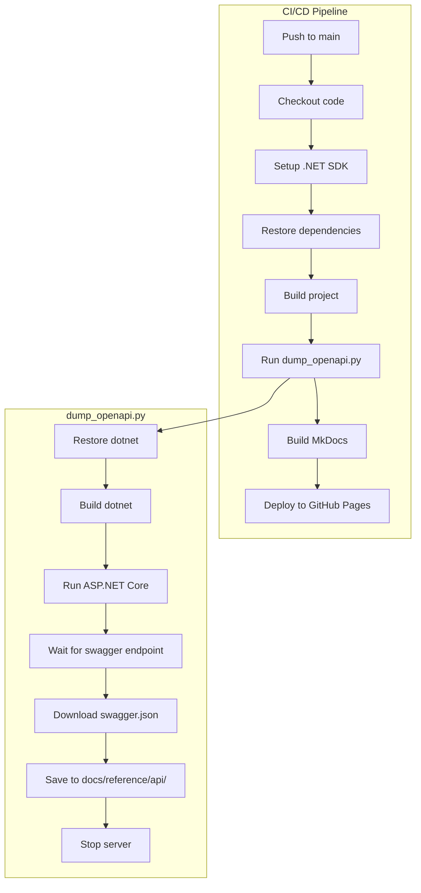

# План интеграции Swagger/OpenAPI в документацию MkDocs

## Контекст

Проект переехал с FastAPI на ASP.NET Core 10. Старый скрипт `scripts/dump_openapi.py` был написан для Python/FastAPI и больше не работает. Нужно:

1. Обновить скрипт для генерации OpenAPI из ASP.NET Core
2. Обновить CI/CD workflow для сборки .NET проекта
3. Обновить документацию

## Что нужно изменить

### 1. `scripts/dump_openapi.py` — полный редизайн

**Текущее состояние:**
- Пытается импортировать Python модуль FastAPI
- Работает только с Python проектом

**Новая реализация:**
- Запускает ASP.NET Core приложение локально на временном порту (5000)
- Ждет пока сервер станет доступен
- Загружает `swagger/v1/swagger.json` с сервера
- Сохраняет результат в `docs/reference/api/openapi.json`
- Останавливает сервер

**Зависимости:**
- .NET 10 SDK должен быть установлен
- Только стандартная библиотека Python (subprocess, json, urllib)

### 2. `.github/workflows/docs.yml` — обновление

**Текущее состояние:**
- Запускает `python scripts/dump_openapi.py` без подготовки .NET окружения

**Новая реализация:**
- Добавить шаг установки .NET SDK (actions/setup-dotnet)
- Добавить шаг сборки проекта перед генерацией OpenAPI
- Обработать ошибку если .NET недоступен (fallback)

### 3. `docs/reference/api/index.md` — обновление

**Текущее состояние:**
- Упоминает FastAPI в инструкции

**Новая реализация:**
- Обновить инструкцию для ASP.NET Core
- Убрать упоминание FastAPI

## Архитектура решения

## Порядок реализации

1. ✅ Создать план
2. Обновить `scripts/dump_openapi.py`
3. Обновить `.github/workflows/docs.yml`
4. Обновить `docs/reference/api/index.md`
5. Протестировать локально
