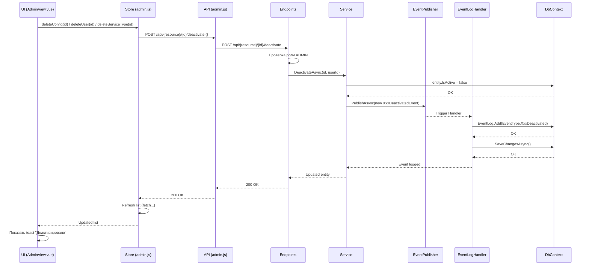

# План реализации Soft Delete (деактивация) для панели администратора

## Контекст

Текущая реализация кнопок "Удалить" во вкладках панели администратора выполняет физическое удаление записей из базы данных через HTTP DELETE. Необходимо заменить это на soft delete (деактивацию), при которой:
- Элементы переводятся в неактивное состояние через поле `IsActive = false`
- Деактивированные элементы не отображаются в списках
- Физическое удаление из базы не происходит
- **Все действия деактивации генерируют события и записываются в EventLog**

## Ролевая проверка

Все новые endpoints будут доступны **только пользователям с ролью ADMIN**:
```csharp
if (!user.IsInRole("ADMIN"))
    return Results.Forbid();
```

---

## Изменения Backend (C#)

### 1. EventType.cs — Добавить новые типы событий

**Файл:** [`backend/src/Domain/Enums/EventType.cs`](backend/src/Domain/Enums/EventType.cs)

**Добавить в конец enum:**
```csharp
// User
UserCreated = 27,
UserUpdated = 28,
UserDeactivated = 29,

// Queue Config
QueueConfigCreated = 0,
QueueConfigUpdated = 1,
QueueConfigDeactivated = 30,

// Service Type
ServiceTypeCreated = 25,
ServiceTypeUpdated = 26,
ServiceTypeDeactivated = 31,
```

---

### 2. UserEvents.cs — Добавить событие UserDeactivatedEvent

**Файл:** [`backend/src/Application/Events/UserEvents.cs`](backend/src/Application/Events/UserEvents.cs)

**Добавить:**
```csharp
/// <summary>
/// Событие: учётная запись сотрудника деактивирована
/// </summary>
public sealed class UserDeactivatedEvent : DomainEvent
{
    public int UserId { get; }
    public string Login { get; }
    public int DeactivatedById { get; }

    public UserDeactivatedEvent(int userId, string login, int deactivatedById)
    {
        UserId = userId;
        Login = login;
        DeactivatedById = deactivatedById;
    }
}
```

---

### 3. QueueConfigEvents.cs — Добавить событие QueueConfigDeactivatedEvent

**Файл:** [`backend/src/Application/Events/QueueConfigEvents.cs`](backend/src/Application/Events/QueueConfigEvents.cs)

**Добавить:**
```csharp
/// <summary>
/// Событие: конфигурация очереди деактивирована
/// </summary>
public sealed class QueueConfigDeactivatedEvent : DomainEvent
{
    public int ConfigId { get; }
    public string ConfigName { get; }
    public int DeactivatedById { get; }

    public QueueConfigDeactivatedEvent(int configId, string configName, int deactivatedById)
    {
        ConfigId = configId;
        ConfigName = configName;
        DeactivatedById = deactivatedById;
    }
}
```

---

### 4. ServiceTypeEvents.cs — Добавить событие ServiceTypeDeactivatedEvent

**Файл:** [`backend/src/Application/Events/ServiceTypeEvents.cs`](backend/src/Application/Events/ServiceTypeEvents.cs)

**Добавить:**
```csharp
/// <summary>
/// Событие: тип услуги деактивирован
/// </summary>
public sealed class ServiceTypeDeactivatedEvent : DomainEvent
{
    public int ServiceTypeId { get; }
    public int QueueConfigId { get; }
    public string Name { get; }
    public int DeactivatedById { get; }

    public ServiceTypeDeactivatedEvent(int serviceTypeId, int queueConfigId, string name, int deactivatedById)
    {
        ServiceTypeId = serviceTypeId;
        QueueConfigId = queueConfigId;
        Name = name;
        DeactivatedById = deactivatedById;
    }
}
```

---

### 5. EventLogDomainEventHandler.cs — Добавить обработчики событий деактивации

**Файл:** [`backend/src/Application/Events/EventLogDomainEventHandler.cs`](backend/src/Application/Events/EventLogDomainEventHandler.cs)

**5a. Добавить в класс-обработчик:**
```csharp
public class EventLogDomainEventHandler :
    ...
    INotificationHandler<UserDeactivatedEvent>,
    INotificationHandler<QueueConfigDeactivatedEvent>,
    INotificationHandler<ServiceTypeDeactivatedEvent>
```

**5b. Добавить методы Handle:**

```csharp
public async Task Handle(UserDeactivatedEvent notification, CancellationToken cancellationToken)
{
    var eventLog = new EventLog
    {
        QueueSessionId = null,
        TicketId = null,
        ActorUserId = notification.DeactivatedById,
        EventType = EventType.UserDeactivated,
        Timestamp = notification.OccurredAt,
        Details = JsonSerializer.Serialize(new { notification.UserId, notification.Login, notification.DeactivatedById })
    };

    _context.EventLogs.Add(eventLog);
    await _context.SaveChangesAsync(cancellationToken);
}

public async Task Handle(QueueConfigDeactivatedEvent notification, CancellationToken cancellationToken)
{
    var eventLog = new EventLog
    {
        QueueSessionId = null,
        TicketId = null,
        ActorUserId = notification.DeactivatedById,
        EventType = EventType.QueueConfigDeactivated,
        Timestamp = notification.OccurredAt,
        Details = JsonSerializer.Serialize(new { notification.ConfigId, notification.ConfigName, notification.DeactivatedById })
    };

    _context.EventLogs.Add(eventLog);
    await _context.SaveChangesAsync(cancellationToken);
}

public async Task Handle(ServiceTypeDeactivatedEvent notification, CancellationToken cancellationToken)
{
    var eventLog = new EventLog
    {
        QueueSessionId = null,
        TicketId = null,
        ActorUserId = notification.DeactivatedById,
        EventType = EventType.ServiceTypeDeactivated,
        Timestamp = notification.OccurredAt,
        Details = JsonSerializer.Serialize(new { notification.ServiceTypeId, notification.QueueConfigId, notification.Name, notification.DeactivatedById })
    };

    _context.EventLogs.Add(eventLog);
    await _context.SaveChangesAsync(cancellationToken);
}
```

---

### 6. UserService.cs — Добавить метод DeactivateAsync

**Файл:** [`backend/src/Application/Services/UserService.cs`](backend/src/Application/Services/UserService.cs)

**Добавить метод:**
```csharp
/// <summary>
/// Деактивация учётной записи (soft delete)
/// </summary>
public async Task<UserDto> DeactivateAsync(int id, int deactivatedById)
{
    var user = await _context.Users
        .FirstOrDefaultAsync(u => u.Id == id);

    if (user == null)
    {
        throw new NotFoundException($"User with id {id} not found");
    }

    user.IsActive = false;
    await _context.SaveChangesAsync();

    // Публикация события
    await _eventPublisher.PublishAsync(new UserDeactivatedEvent(user.Id, user.Login, deactivatedById));

    return MapToDto(user);
}
```

---

### 7. QueueConfigService.cs — Добавить метод DeactivateAsync

**Файл:** [`backend/src/Application/Services/QueueConfigService.cs`](backend/src/Application/Services/QueueConfigService.cs)

**Добавить метод:**
```csharp
/// <summary>
/// Деактивация конфигурации очереди (soft delete)
/// </summary>
public async Task<QueueConfigDto> DeactivateAsync(int id, int deactivatedById)
{
    var config = await _context.QueueConfigs
        .FirstOrDefaultAsync(q => q.Id == id);

    if (config == null)
    {
        throw new NotFoundException($"QueueConfig with id {id} not found");
    }

    config.IsActive = false;
    await _context.SaveChangesAsync();

    // Публикация события
    await _eventPublisher.PublishAsync(new QueueConfigDeactivatedEvent(config.Id, config.Name, deactivatedById));

    return MapToDto(config);
}
```

---

### 8. ServiceTypeService.cs — Добавить метод DeactivateAsync + обновить GetAllWithConfigAsync

**Файл:** [`backend/src/Application/Services/ServiceTypeService.cs`](backend/src/Application/Services/ServiceTypeService.cs)

**8a. Добавить метод:**
```csharp
/// <summary>
/// Деактивация типа услуги (soft delete)
/// </summary>
public async Task<ServiceTypeDto> DeactivateAsync(int id, int deactivatedById)
{
    var serviceType = await _context.ServiceTypes
        .FirstOrDefaultAsync(st => st.Id == id);

    if (serviceType == null)
    {
        throw new NotFoundException($"ServiceType with id {id} not found");
    }

    serviceType.IsActive = false;
    await _context.SaveChangesAsync();

    // Публикация события
    await _eventPublisher.PublishAsync(new ServiceTypeDeactivatedEvent(
        serviceType.Id,
        serviceType.QueueConfigId,
        serviceType.Name,
        deactivatedById
    ));

    return MapToDto(serviceType);
}
```

**8b. Обновить метод `GetAllWithConfigAsync()` (строка 40):**

**Было:**
```csharp
var serviceTypes = await _context.ServiceTypes
    .Include(st => st.QueueConfig)
    .OrderBy(st => st.QueueConfigId)
    .ThenBy(st => st.SortOrder)
    .ToListAsync();
```

**Стало:**
```csharp
var serviceTypes = await _context.ServiceTypes
    .Include(st => st.QueueConfig)
    .Where(st => st.IsActive)  // Фильтр по IsActive
    .OrderBy(st => st.QueueConfigId)
    .ThenBy(st => st.SortOrder)
    .ToListAsync();
```

---

### 9. UserEndpoints.cs — Добавить endpoint деактивации

**Файл:** [`backend/src/Api/Endpoints/UserEndpoints.cs`](backend/src/Api/Endpoints/UserEndpoints.cs)

**Добавить в `MapUserEndpoints`:**
```csharp
endpointGroup.MapPost("/{id:int}/deactivate", DeactivateUser);
```

**Добавить метод:**
```csharp
/// <summary>
/// Деактивация учётной записи (только ADMIN)
/// </summary>
private static async Task<IResult> DeactivateUser(
    int id,
    [FromBody] DeactivateRequest dto,
    ClaimsPrincipal user,
    UserService service)
{
    var userId = user.GetUserId();
    if (userId == null)
        return Results.Unauthorized();
        
    if (!user.IsInRole("ADMIN"))
        return Results.Forbid();
        
    var updated = await service.DeactivateAsync(id, userId.Value);
    return Results.Ok(updated);
}
```

---

### 10. QueueConfigEndpoints.cs — Добавить endpoint деактивации

**Файл:** [`backend/src/Api/Endpoints/QueueConfigEndpoints.cs`](backend/src/Api/Endpoints/QueueConfigEndpoints.cs)

**Добавить в `MapQueueConfigEndpoints`:**
```csharp
endpointGroup.MapPost("/{id:int}/deactivate", DeactivateConfig);
```

**Добавить метод:**
```csharp
/// <summary>
/// Деактивация конфигурации очереди (только ADMIN)
/// </summary>
private static async Task<IResult> DeactivateConfig(
    int id,
    [FromBody] DeactivateRequest dto,
    ClaimsPrincipal user,
    QueueConfigService service)
{
    var userId = user.GetUserId();
    if (userId == null)
        return Results.Unauthorized();
        
    if (!user.IsInRole("ADMIN"))
        return Results.Forbid();
        
    var updated = await service.DeactivateAsync(id, userId.Value);
    return Results.Ok(updated);
}
```

---

### 11. ServiceTypeEndpoints.cs — Добавить endpoint деактивации

**Файл:** [`backend/src/Api/Endpoints/ServiceTypeEndpoints.cs`](backend/src/Api/Endpoints/ServiceTypeEndpoints.cs)

**Добавить в `MapServiceTypeEndpoints`:**
```csharp
endpointGroup.MapPost("/{id:int}/deactivate", DeactivateServiceType);
```

**Добавить метод:**
```csharp
/// <summary>
/// Деактивация типа услуги (только ADMIN)
/// </summary>
private static async Task<IResult> DeactivateServiceType(
    int id,
    [FromBody] DeactivateRequest dto,
    ClaimsPrincipal user,
    ServiceTypeService service)
{
    var userId = user.GetUserId();
    if (userId == null)
        return Results.Unauthorized();
        
    if (!user.IsInRole("ADMIN"))
        return Results.Forbid();
        
    var updated = await service.DeactivateAsync(id, userId.Value);
    return Results.Ok(updated);
}
```

---

## Изменения Frontend (Vue/JS)

### 12. admin.js (API) — Добавить методы деактивации

**Файл:** [`frontend/user/user-interface/src/api/admin.js`](frontend/user/user-interface/src/api/admin.js)

**Добавить методы:**
```javascript
// QueueConfig
deactivateQueueConfig(id) {
  return apiClient.post(`/api/queue-configs/${id}/deactivate`, {})
    .then(response => response.data)
},

// User
deactivateUser(id) {
  return apiClient.post(`/api/users/${id}/deactivate`, {})
    .then(response => response.data)
},

// ServiceType
deactivateServiceType(id) {
  return apiClient.post(`/api/service-types/${id}/deactivate`, {})
    .then(response => response.data)
}
```

**Экспорт:**
```javascript
export const deactivateQueueConfig = adminApi.deactivateQueueConfig
export const deactivateUser = adminApi.deactivateUser
export const deactivateServiceType = adminApi.deactivateServiceType
```

---

### 13. admin.js (Store) — Добавить методы деактивации

**Файл:** [`frontend/user/user-interface/src/stores/admin.js`](frontend/user/user-interface/src/stores/admin.js)

**Добавить методы:**
```javascript
async function deactivateQueueConfig(id) {
  loading.value = true
  try {
    await api.deactivateQueueConfig(id)
    await fetchQueueConfigs()
  } catch (err) {
    error.value = err.response?.data?.error || 'Ошибка деактивации конфигурации'
    console.error('Failed to deactivate queue config', err)
    throw err
  } finally {
    loading.value = false
  }
}

async function deactivateUser(id) {
  loading.value = true
  try {
    await api.deactivateUser(id)
    await fetchUsers()
  } catch (err) {
    error.value = err.response?.data?.error || 'Ошибка деактивации пользователя'
    console.error('Failed to deactivate user', err)
    throw err
  } finally {
    loading.value = false
  }
}

async function deactivateServiceType(id) {
  loading.value = true
  try {
    await api.deactivateServiceType(id)
    await fetchServiceTypes()
  } catch (err) {
    error.value = err.response?.data?.error || 'Ошибка деактивации типа услуги'
    console.error('Failed to deactivate service type', err)
    throw err
  } finally {
    loading.value = false
  }
}
```

**Добавить в return:**
```javascript
deactivateQueueConfig,
deactivateUser,
deactivateServiceType
```

---

### 14. AdminView.vue — Обновить кнопки "Удалить"

**Файл:** [`frontend/user/user-interface/src/views/AdminView.vue`](frontend/user/user-interface/src/views/AdminView.vue)

**14a. Конфигурации (строка ~147):**
```vue
<!-- Было -->
<button class="btn btn-sm btn-outline-danger" @click="deleteConfig(config.id)">Удалить</button>

<!-- Стало -->
<button class="btn btn-sm btn-outline-danger" @click="deactivateConfig(config.id)">Удалить</button>
```

**14b. Пользователи (строка ~187):**
```vue
<!-- Было -->
<button class="btn btn-sm btn-outline-danger" @click="deleteUser(user.id)">Удалить</button>

<!-- Стало -->
<button class="btn btn-sm btn-outline-danger" @click="deactivateUser(user.id)">Удалить</button>
```

**14c. Типы услуг (строка ~227):**
```vue
<!-- Было -->
<button class="btn btn-sm btn-outline-danger" @click="deleteServiceType(type.id)">Удалить</button>

<!-- Стало -->
<button class="btn btn-sm btn-outline-danger" @click="deactivateServiceType(type.id)">Удалить</button>
```

**14d. Обновить обработчики в methods:**
```javascript
// Было
deleteConfig(id) {
  this.$refs.modalConfirmDelete.open('Конфигурация', id, async () => {
    await this.adminStore.deleteQueueConfig(id)
    this.showToast('Конфигурация удалена', 'success')
  })
},

// Стало
deactivateConfig(id) {
  this.$refs.modalConfirmDelete.open('Конфигурация', id, async () => {
    await this.adminStore.deactivateQueueConfig(id)
    this.showToast('Конфигурация деактивирована', 'success')
  })
},
```

---

## Диаграмма последовательности



---

## Файлы для изменения

| # | Файл | Тип изменения |
|---|------|---------------|
| 1 | [`backend/src/Domain/Enums/EventType.cs`](backend/src/Domain/Enums/EventType.cs) | Добавить `UserDeactivated`, `QueueConfigDeactivated`, `ServiceTypeDeactivated` |
| 2 | [`backend/src/Application/Events/UserEvents.cs`](backend/src/Application/Events/UserEvents.cs) | Добавить `UserDeactivatedEvent` |
| 3 | [`backend/src/Application/Events/QueueConfigEvents.cs`](backend/src/Application/Events/QueueConfigEvents.cs) | Добавить `QueueConfigDeactivatedEvent` |
| 4 | [`backend/src/Application/Events/ServiceTypeEvents.cs`](backend/src/Application/Events/ServiceTypeEvents.cs) | Добавить `ServiceTypeDeactivatedEvent` |
| 5 | [`backend/src/Application/Events/EventLogDomainEventHandler.cs`](backend/src/Application/Events/EventLogDomainEventHandler.cs) | Добавить обработчики для 3 событий деактивации |
| 6 | [`backend/src/Application/Services/UserService.cs`](backend/src/Application/Services/UserService.cs) | Добавить метод `DeactivateAsync` |
| 7 | [`backend/src/Application/Services/QueueConfigService.cs`](backend/src/Application/Services/QueueConfigService.cs) | Добавить метод `DeactivateAsync` |
| 8 | [`backend/src/Application/Services/ServiceTypeService.cs`](backend/src/Application/Services/ServiceTypeService.cs) | Добавить метод `DeactivateAsync`, обновить `GetAllWithConfigAsync` |
| 9 | [`backend/src/Api/Endpoints/UserEndpoints.cs`](backend/src/Api/Endpoints/UserEndpoints.cs) | Добавить endpoint и метод `DeactivateUser` |
| 10 | [`backend/src/Api/Endpoints/QueueConfigEndpoints.cs`](backend/src/Api/Endpoints/QueueConfigEndpoints.cs) | Добавить endpoint и метод `DeactivateConfig` |
| 11 | [`backend/src/Api/Endpoints/ServiceTypeEndpoints.cs`](backend/src/Api/Endpoints/ServiceTypeEndpoints.cs) | Добавить endpoint и метод `DeactivateServiceType` |
| 12 | [`frontend/user/user-interface/src/api/admin.js`](frontend/user/user-interface/src/api/admin.js) | Добавить методы `deactivateXxx` |
| 13 | [`frontend/user/user-interface/src/stores/admin.js`](frontend/user/user-interface/src/stores/admin.js) | Добавить методы `deactivateXxx` |
| 14 | [`frontend/user/user-interface/src/views/AdminView.vue`](frontend/user/user-interface/src/views/AdminView.vue) | Заменить вызовы `deleteXxx` на `deactivateXxx` |

---

## Примечания

1. **События:** Все действия деактивации генерируют события, которые автоматически записываются в таблицу `EventLog` через `EventLogDomainEventHandler`.

2. **Восстановление:** В будущем можно добавить endpoint `POST /api/{resource}/{id}/activate` для повторной активации.

3. **История изменений:** При необходимости аудита можно логировать изменения `IsActive` в таблицу `EventLog` (уже реализовано через события).

4. **Валидация:** На уровне сервисов можно добавить проверку, что нельзя деактивировать уже деактивированный элемент (хотя это не критично, так как `IsActive` просто установится в `false`).
